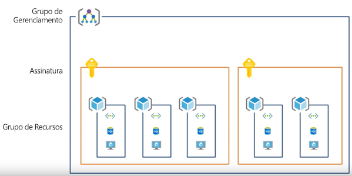
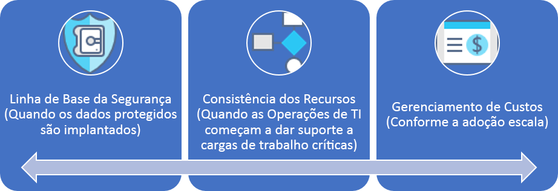

# Percurso de governança de empresas de pequeno a médio porte

## Visão geral de prática recomendada

Essa jornada de governança segue as experiências de uma empresa fictícia por vários estágios de maturidade de governança. Ela se baseia em percursos de clientes reais. As práticas recomendadas sugeridas baseiam-se nas restrições e necessidades da empresa fictícia.

Como um ponto de partida rápido, esta visão geral define um produto mínimo viável (MVP) para um controle com base em práticas recomendadas. Também fornece links para algumas evoluções de governança que adicionam ainda mais as práticas recomendadas conforme novos negócios ou riscos técnicos surgirem.

> [!WARNING]
> Este MVP é um ponto de partida de linha de base, com base em um conjunto de suposições. Até mesmo esse conjunto mínimo de práticas recomendadas tem como base as políticas corporativas orientadas por riscos comerciais exclusivos e as tolerâncias de risco. Para ver se essas suposições se aplicam a você, leia a [narrativa mais longa](./narrative.md) que acompanha este artigo.

## Prática recomendada de governança

Esta prática recomendada serve como uma base que uma organização pode usar para adicionar as grades de proteção de governança de forma rápida e consistente entre várias assinaturas do Azure.

### Organização do recurso

O diagrama a seguir mostra a hierarquia de MVP de governança para organizar recursos.

Todos os aplicativos devem ser implantados na área apropriada do grupo de gerenciamento, assinatura e hierarquia de grupo de recursos. Durante o planejamento da implantação, a equipe de governança de nuvem criará os nós necessários na hierarquia para capacitar as equipes de adoção da nuvem.  

1. Um grupo de gerenciamento para cada tipo de ambiente (por exemplo, produção, desenvolvimento e teste).
2. Uma assinatura para cada “categorização de aplicativo”.
3. Um grupo de recursos separado para cada aplicativo.
4. A nomenclatura consistente deve ser aplicada em cada nível dessa hierarquia de agrupamento.

Veja um exemplo desse padrão em uso:

Esses padrões fornecem espaço para crescimento sem complicar a hierarquia desnecessariamente.

[!INCLUDE [governance-of-resources](../../../../../includes/cloud-adoption/governance/governance-of-resources.md)]

## Evoluções de governança

Quando esse MVP tiver sido implantado, camadas adicionais de governança podem ser incorporadas rapidamente ao ambiente. Aqui estão algumas maneiras de desenvolver o MVP para atender às necessidades específicas de negócios:

- [Linha de base para dados protegidos](./security-baseline-evolution.md)
- [Configurações de recurso para aplicativos de missão crítica](./resource-consistency-evolution.md)
- [Controles para Gerenciamento de Custos](./cost-management-evolution.md)
- [Controles para evolução de várias nuvens](./multi-cloud-evolution.md)

<!-- markdownlint-disable MD026 -->

## O que faz essa prática recomendada?

No MVP, nas práticas recomendadas e nas ferramentas da disciplina [Aceleração da implantação](../../deployment-acceleration/overview.md), são estabelecidas para rapidamente aplicar a política corporativa. Em particular, o MVP usa o Azure Blueprints, Azure Policy e grupos de gerenciamento do Azure para aplicar algumas políticas corporativas básicas, conforme definido na narrativa para esta empresa fictícia. Essas políticas corporativas são aplicadas usando modelos do Gerenciador de Recursos e as políticas do Azure para estabelecer uma linha de base muito pequena para identidade e segurança.

## Evoluindo a prática recomendada

Ao longo do tempo, esse controle MVP será usado para desenvolver as práticas de governança. Conforme a adoção avança, aumenta o risco de negócios. Várias disciplinas dentro do modelo de governança CAF evoluem para atenuar esses riscos. Artigos mais adiante nesta série discutem a evolução da política corporativa que afeta a empresa fictícia. Três evoluções ocorrem em três disciplinas:

- Gerenciamento de Custos como escalas de adoção.
- Linha de base de segurança, como os dados protegidos são implantados.
- Consistência de recursos, como operações de TI começam a dar suporte a cargas de trabalho de missão crítica.

## Próximas etapas

Agora que você está familiarizado com a governança MVP e tem uma ideia das evoluções de governança a seguir, leia a narrativa de suporte para o contexto adicional.

> [!div class="nextstepaction"]
> [Leia a narrativa de suporte](./narrative.md)
