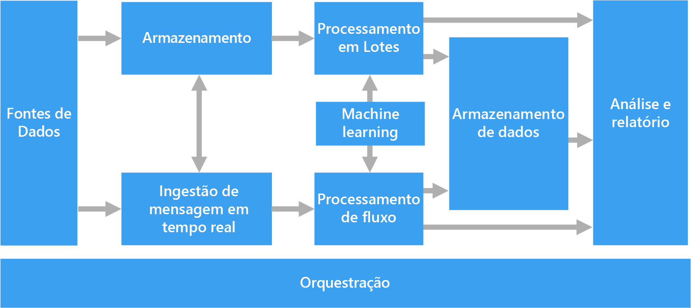
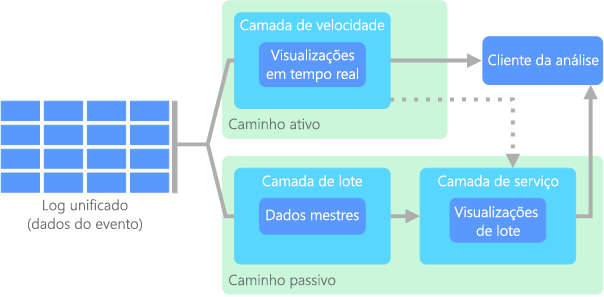
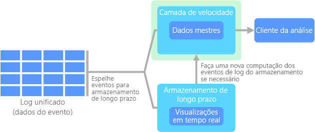
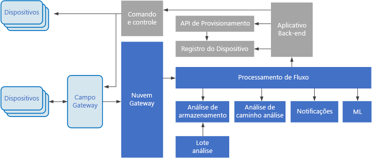

# Arquiteturas de Big Data

Uma arquitetura de Big Data foi projetada para lidar com ingestão, processamento e análise de dados grandes ou complexos demais para sistemas de banco de dados tradicionais. O limite no qual as organizações ingressam no campo do Big Data é diferente, dependendo das capacidades dos usuários e de suas ferramentas. Para alguns, isso pode significar centenas de gigabytes de dados, enquanto para outros, centenas de terabytes. À medida que as ferramentas para o trabalho com conjuntos de Big Data evoluem, na mesma proporção evolui o significado de Big Data. Cada vez mais, esse termo se relaciona ao valor que é possível extrair dos conjuntos de dados por meio de análise avançada, em vez de estritamente o tamanho dos dados, embora nesses casos, eles tendam a ser muito grandes.

Ao longo dos anos, o cenário dos dados vem mudando. Houve uma mudança no que você pode fazer ou o que deve fazer, com os dados. O custo de armazenamento caiu drasticamente, enquanto os meios pelos quais os dados são coletados continuam aumentando. Alguns dados são recebidos a um ritmo rápido, constantemente exigindo sua coleta e observação. Outros dados são recebidos mais lentamente, mas em partes muito grandes, geralmente na forma de décadas de dados históricos. Talvez você esteja enfrentando um problema de análise avançada ou um problema que exija o aprendizado de máquina. Esses são desafios que as arquiteturas de Big Data buscam resolver.

Soluções de Big Data normalmente envolvem um ou mais dos seguintes tipos de carga de trabalho:

* Processamento em lote de fontes Big Data em repouso.
* Processamento em tempo real de Big Data em movimento.
* Exploração interativa de Big Data.
* Análise preditiva e machine learning.

Considere o uso das arquiteturas de Big Data quando precisar:

* Armazenar e processar dados em volumes muito grandes para um banco de dados tradicional.
* Transformar dados não estruturados para análise e relatório.
* Capturar, processar e analisar fluxos não associados de dados em tempo real ou com baixa latência.

## Componentes de uma arquitetura de Big Data

O diagrama a seguir mostra os componentes lógicos que se inserem em uma arquitetura de Big Data. As soluções individuais podem não conter todos os itens neste diagrama.

 

A maioria das arquiteturas de Big Data inclui alguns ou todos os seguintes componentes:

* **Fontes de dados**. Todas as soluções de Big Data começam com uma ou mais fontes de dados. Os exemplos incluem:

    * Armazenamentos de dados de aplicativo, como bancos de dados relacionais.
    * Arquivos estáticos produzidos por aplicativos, como arquivos de log do servidor Web.
    * Fontes de dados em tempo real, como dispositivos IoT.

* **Armazenamento de dados**. Os dados de operações de processamento em lotes normalmente são armazenados em um repositório de arquivos distribuído que pode conter amplos volumes de arquivos grandes em vários formatos. Esse tipo de repositório geralmente é chamado *data lake*. As opções para implementar esse armazenamento incluem contêineres de blobs ou Azure Data Lake Store no Armazenamento do Azure.

* **Processamento em lotes**. Como os conjuntos de dados são muito grandes, geralmente, uma solução de Big Data precisa processar arquivos de dados usando trabalhos em lotes de execução longa para filtrar, agregar e, de outro modo, preparar os dados para análise. Normalmente, esses trabalhos envolvem ler arquivos de origem, processá-los e gravar a saída para novos arquivos. Opções incluem executar trabalhos de U-SQL no Azure Data Lake Analytics, usar trabalhos Hive, Pig ou de Mapear/Reduzir personalizados em um cluster HDInsight Hadoop ou usar programas de Java, Scala ou Python em um cluster HDInsight Spark.

* **Ingestão de mensagens em tempo real**. Se a solução inclui fontes em tempo real, a arquitetura precisa incluir uma maneira de capturar e armazenar mensagens em tempo real para processamento de fluxo. Isso pode ser um armazenamento de dados simples, em que as mensagens de entrada são removidas para uma pasta para processamento. No entanto, muitas soluções precisam de um repositório de ingestão de mensagens para atuar como buffer de mensagens e dar suporte a processamento de expansão, entrega confiável e outras semânticas de enfileiramento de mensagem. Essa parte de uma arquitetura de streaming geralmente é conhecida como buffer de fluxo. Entre as opções estão os Hubs de Eventos do Azure, o Hub IoT do Azure e o Kafka.

* **Processamento de fluxo**. Depois de capturar mensagens em tempo real, a solução precisa processá-las filtrando, agregando e preparando os dados para análise. Os dados de fluxo processados são gravados em um coletor de saída. O Azure Stream Analytics oferece um serviço de processamento de fluxo gerenciado baseado em consultas SQL em execução perpétua que operam em fluxos não associados. Você também pode usar tecnologias de streaming Apache de software livre, como Storm e Spark Streaming em um cluster HDInsight.

* **Armazenamento de dados analíticos**. Muitas soluções de Big Data preparam dados para análise e então fornecem os dados processados em um formato estruturado que pode ser consultado com ferramentas analíticas. O armazenamento de dados analíticos usado para atender a essas consultas pode ser um data warehouse relacional estilo Kimball, como visto na maioria das soluções de BI (business intelligence) tradicionais. Como alternativa, os dados podem ser apresentados por meio de uma tecnologia NoSQL de baixa latência, como HBase ou um banco de dados Hive interativo que oferece uma abstração de metadados sobre arquivos de dados no armazenamento de dados distribuído. O SQL Data Warehouse do Azure fornece um serviço gerenciado para armazenamento de dados em larga escala baseado em nuvem. O HDInsight dá suporte a Hive interativo, HBase e Spark SQL, que também pode ser usado para veicular dados para análise.

* **Análise e relatórios**. A meta da maioria das soluções de Big Data é gerar insights sobre os dados por meio de análise e relatórios. Para capacitar os usuários a analisar os dados, a arquitetura pode incluir uma camada de modelagem de dados, como um cubo OLAP multidimensional ou um modelo de dados tabular no Azure Analysis Services. Também pode dar suporte a business intelligence de autoatendimento, usando as tecnologias de modelagem e visualização do Microsoft Power BI ou do Microsoft Excel. Análise e relatórios também podem assumir a forma de exploração de dados interativos por cientistas de dados ou analistas de dados. Para esses cenários, muitos serviços do Azure dão suporte a blocos de anotações analíticos, como Jupyter, permitindo que esses usuários aproveitem suas habilidades existentes com Python ou R. Para exploração de dados em larga escala, você pode usar o Microsoft R Server, seja no modo autônomo ou com Spark.

* **Orquestração**. A maioria das soluções de Big Data consiste em operações de processamento de dados repetidas, encapsuladas em fluxos de trabalho, que transformam dados de origem, movem dados entre várias origens e coletores, carregam os dados processados em um armazenamento de dados analíticos ou enviam os resultados por push diretamente para um relatório ou painel. Para automatizar esses fluxos de trabalho, você pode usar uma tecnologia de orquestração, como Azure Data Factory ou Apache Oozie e Sqoop.

## Arquitetura lambda

Ao trabalhar com conjuntos de dados muito grandes, pode levar muito tempo para executar a classificação de consultas de que os clientes precisam. Essas consultas não podem ser executadas em tempo real e geralmente exigem algoritmos como [MapReduce](https://en.wikipedia.org/wiki/MapReduce), que operam em paralelo em todo o conjunto de dados. Os resultados são então armazenados separadamente dos dados brutos e usados para consulta.

Uma desvantagem dessa abordagem é que ela introduz latência &mdash; se o processamento levar algumas horas, uma consulta poderá retornar resultados de várias horas atrás. O ideal é que você obtenha alguns resultados em tempo real (talvez com alguma perda de precisão) e combine esses resultados com os resultados da análise de lote.

A **arquitetura lambda**, primeiramente proposta por Nathan Marz, resolve esse problema criando dois caminhos para o fluxo de dados. Todos os dados recebidos pelo sistema passam por esses dois caminhos:

* Uma **camada de lote** (caminho frio) armazena todos os dados de entrada em sua forma bruta e executa o processamento em lotes nos dados. O resultado desse processamento é armazenado como uma **exibição de lote**.

* Uma **camada de velocidade** (caminho quente) analisa os dados em tempo real. Essa camada foi projetada para baixa latência, em detrimento da precisão.

A camada de lote alimenta uma **camada de serviço** que indexa a exibição de lote para uma consulta eficiente. A camada de velocidade atualiza a camada de serviço com atualizações incrementais de acordo com os dados mais recentes.

Os dados que fluem para o caminho quente são restritos por requisitos de latência impostos pela camada de velocidade, de modo que ela possa ser processada o mais rapidamente possível. Geralmente, isso exige uma desvantagem de algum nível de precisão em favor dos dados que estão prontos o mais rapidamente possível. Por exemplo, considere um cenário de IoT em que um grande número de sensores de temperatura envia dados telemétricos. A camada de velocidade pode ser usada para processar uma janela de tempo deslizante dos dados de entrada. 

Os dados que fluem para o caminho frio, por outro lado, não estão sujeitos aos mesmos requisitos de baixa latência. Isso permite uma computação de alta precisão em conjuntos de dados grandes, o que pode ser muito demorado. 

Em última análise, os caminhos quente e frio convergem no aplicativo cliente de análise. Se o cliente precisar exibir dados em tempo hábil, mas potencialmente menos precisos em tempo real, ele adquirirá seu resultado do caminho quente. Caso contrário, ele selecionará resultados do caminho frio para exibir dados em menos tempo hábil, mas mais precisos. Em outras palavras, o caminho quente contém dados para uma janela relativamente pequena de tempo, após o qual os resultados podem ser atualizados com os dados mais precisos do caminho frio.

Os dados brutos armazenados na camada de lote são imutáveis. Os dados de entrada sempre são acrescentados aos dados existentes e os dados anteriores nunca são substituídos. As alterações no valor de um dado específico são armazenadas como um novo registro de evento com carimbo de data/hora. Isso permite o recálculo em qualquer ponto no tempo no histórico dos dados coletados. A capacidade de recalcular a exibição de lote dos dados brutos originais é importante, pois permite que novas exibições sejam criadas conforme o sistema evolui. 

## Arquitetura de kappa

Uma desvantagem da arquitetura de lambda é sua complexidade. A lógica de processamento aparece em dois lugares diferentes &mdash; os caminhos frio e quente &mdash; usando estruturas diferentes. Isso leva a uma lógica de cálculo duplicada e a complexidade de gerenciar a arquitetura para os dois caminhos.

A **arquitetura de kappa** foi proposta por Jay Kreps como uma alternativa à arquitetura de lambda. Ela tem as mesmas metas básicas da arquitetura de lambda, mas com uma diferença importante: todos os dados fluem por um único caminho, usando um sistema de processamento de fluxo. 

Há algumas semelhanças na camada de lote da arquitetura de lambda, em que os dados do evento são imutáveis e todos eles são coletados, em vez de um subconjunto. Os dados são ingeridos como um fluxo de eventos em um log unificado distribuído e tolerante a falhas. Esses eventos são ordenados e o estado atual de um evento é alterado somente por um novo evento que está sendo acrescentado. Semelhante à camada de velocidade da arquitetura de uma lambda, todo o processamento de eventos é feito no fluxo de entrada e persistido como uma exibição em tempo real. 

Se você precisar recalcular todo o conjunto de dados (equivalente ao que a camada de lote faz no lambda), basta reproduzir o fluxo, normalmente usando o paralelismo para concluir o cálculo em tempo hábil.

## Internet das coisas (IoT)

Do ponto de vista prático, a IoT (Internet das Coisas) representa qualquer dispositivo conectado à Internet. Isso inclui seu computador, telefone celular, relógio inteligente, termostato inteligente, refrigerador inteligente, automóvel conectado, implantes de monitoramento cardíaco e qualquer outra coisa que se conecta à Internet e envia ou recebe dados. O número de dispositivos conectados cresce diariamente, assim como a quantidade de dados coletados deles. Em geral, esses dados são coletados em ambientes altamente restritos, às vezes, de alta latência. Em outros casos, os dados são enviados de ambientes de baixa latência por milhares ou milhões de dispositivos, que necessitam da capacidade de ingerir os dados rapidamente e processá-lo de forma adequada. Portanto, um planejamento adequado é necessário para lidar com essas restrições e esses requisitos exclusivos.

Arquiteturas orientadas por eventos são essenciais para soluções de IoT. O diagrama a seguir mostra uma possível arquitetura lógica de IoT. O diagrama enfatiza os componentes da arquitetura do streaming de eventos.

O **gateway de nuvem** consome eventos de dispositivo no limite da nuvem, usando um sistema de mensagens de latência baixa e confiável.

Os dispositivos podem enviar eventos diretamente para o gateway de nuvem, ou por meio de um **gateway de campo**. Um gateway de campo é um software ou dispositivo especializado, geralmente colocado com os dispositivos, que recebe eventos e os encaminha para o gateway de nuvem. O gateway de campo também pode pré-processar os eventos de dispositivo brutos executando funções, como filtragem, agregação ou transformação de protocolo.

Após a ingestão, os eventos passam por um ou mais **processadores de fluxo** que podem encaminhar os dados (por exemplo, para armazenamento) ou executar análise e outros tipos de processamento.

A seguir estão alguns tipos comuns de processamento. (Esta lista certamente não é exaustiva.)

- Gravando os dados de evento para armazenamento menos acessado, para arquivamento ou análise de processo em lote.

- Análise de caminho mais acessado, analisando o fluxo de eventos (quase) em tempo real, para detectar anomalias, reconhecer padrões em janelas de tempo ou disparar alertas quando ocorre uma condição específica no fluxo. 

- Tratamento de tipos especiais de mensagens que não são de telemetria de dispositivos, como notificações e alarmes. 

- Machine Learning.

As caixas destacadas em cinza mostram os componentes de um sistema de IoT que não estão diretamente relacionadas ao streaming de evento, mas são incluídos aqui para fins de integridade.

- O **registro do dispositivo** é um banco de dados dos dispositivos provisionados, incluindo os IDs de dispositivo e metadados do dispositivo, como localização.

- A **API de provisionamento** é uma interface externa comum para provisionar e registrar dispositivos novos.

- Algumas soluções IoT permitem que **mensagens de comando e controle** sejam enviadas aos dispositivos.

Serviços do Azure relevantes:

- [Hub IoT do Azure](https://azure.microsoft.com/services/iot-hub/)
- [Hubs de eventos do Azure](https://azure.microsoft.com/services/event-hubs/)
- [Stream Analytics do Azure](https://azure.microsoft.com/services/stream-analytics/)  

Saiba mais sobre o IoT no Azure lendo a [arquitetura de referência do IoT do Azure](https://azure.microsoft.com/updates/microsoft-azure-iot-reference-architecture-available/).

