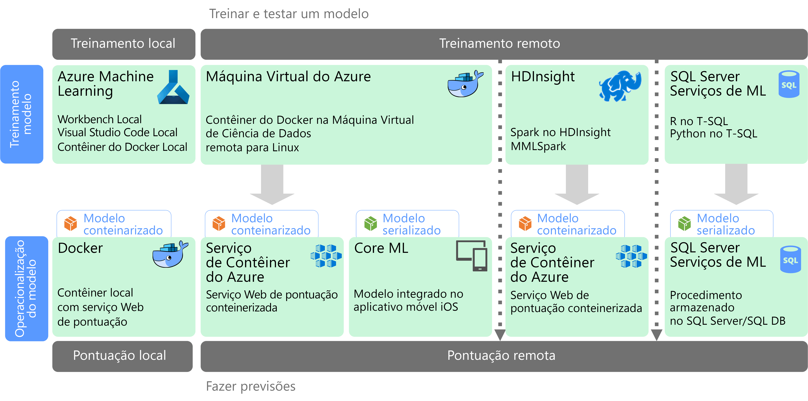

# Aprendizado de máquina em escala

O ML (aprendizado de máquina) é uma técnica usada para treinar modelos preditivos com base em algoritmos matemáticos. O aprendizado de máquina analisa as relações entre os campos de dados para prever valores desconhecidos.

A criação e implantação de um modelo de aprendizado de máquina é um processo iterativo:

- Os cientistas de dados exploram os dados de origem para determinar as relações entre os *recursos* e os *rótulos* previstos.
- Os cientistas de dados treinam e validam modelos com base em algoritmos apropriados para encontrar o modelo ideal para previsão.
- O modelo ideal é implantado em produção, como um serviço Web ou outra função encapsulada.
- Conforme novos dados são coletados, o modelo é periodicamente retreinado para melhorar sua eficácia.

O aprendizado de máquina em escala aborda dois interesses de escalabilidade diferentes. O primeiro é o treinamento de um modelo em conjuntos grandes de dados que exigem funcionalidades de expansão de um cluster a ser treinado. O segundo concentra-se na operacionalização do modelo aprendido de forma que ele possa ser dimensionado para atender às demandas dos aplicativos que o consomem. Normalmente, isso é feito pela implantação das funcionalidades preditivas como um serviço Web que podem então ser expandidas.

O aprendizado de máquina em escala traz o benefício de geração de funcionalidades preditivas avançadas, porque modelos melhores normalmente resultam de mais dados. Depois que um modelo é treinado, ele pode ser implantado como um serviço Web de expansão sem monitoração de estado e de alto desempenho.

## Preparação de modelo e treinamento

Durante a fase de preparação de modelo e treinamento, os cientistas de dados exploram os dados de maneira interativa usando linguagens como o Python e o R para:

- Extrair amostras de armazenamentos de dados de alto volume.
- Localizar e tratar exceções, duplicatas e valores ausentes para limpar os dados.
- Determinar correlações e relações nos dados por meio de análise estatística e visualização.
- Gerar novos recursos calculados que melhoram a previsibilidade de relações estatísticas.
- Treinar os modelos de ML com base em algoritmos preditivos.
- Validar os modelos treinados usando dados que foram retidos durante o treinamento.

Para dar suporte a essa fase interativa de análise e modelagem, a plataforma de dados precisa permitir aos cientistas de dados explorar os dados usando uma variedade de ferramentas. Além disso, o treinamento de um modelo de aprendizado de máquina complexo pode exigir uma grande quantidade de processamento intensivo de amplos volumes de dados; portanto, é essencial ter recursos suficientes para a expansão do treinamento do modelo.

## Implantação e consumo de modelo

Quando um modelo está pronto para ser implantado, ele pode ser encapsulado como um serviço Web e implantado na nuvem, em um dispositivo de borda ou em um ambiente empresarial de execução do ML. Esse processo de implantação é conhecido como operacionalização.

## Desafios

O aprendizado de máquina em escala apresenta alguns desafios:

- Normalmente, você precisa de muitos dados para treinar um modelo, especialmente para modelos de aprendizado profundo.
- Você precisa preparar esses conjuntos de Big Data antes mesmo de começar a treinar o modelo.
- A fase de treinamento de modelo precisa acessar os armazenamentos de Big Data. É comum realizar o treinamento de modelo usando o mesmo cluster de Big Data, como o Spark, que é usado para preparação de dados.
- Para cenários como aprendizado profundo, você precisará não apenas de um cluster que possa fornecer a expansão em CPUs, mas o cluster também precisará consistir em nós habilitados para GPU.

## Aprendizado de máquina em escala no Azure

Antes de decidir quais serviços de ML serão usados em treinamento e operacionalização, considere se você precisa mesmo treinar um modelo ou se um modelo predefinido pode atender às suas necessidades. Em muitos casos, o uso de um modelo predefinido é apenas uma questão de chamar um serviço Web ou usar uma biblioteca de ML para carregar um modelo existente. Algumas opções incluem:

- Usar os serviços Web fornecidos pelos Serviços Cognitivos da Microsoft.
- Usar os modelos de rede neural pré-treinados fornecidos pelo Cognitive Toolkit.
- Inserir os modelos serializados fornecidos pelo Core ML para aplicativos iOS.

Se um modelo predefinido não se ajusta aos seus dados ou ao seu cenário, outras opções no Azure incluem o Azure Machine Learning, HDInsight com Spark MLlib e MMLSpark, Azure Databricks, Cognitive Toolkit e SQL Machine Learning Services. Se você decidir usar um modelo personalizado, precisará criar um pipeline que inclui o treinamento e a operacionalização do modelo.

Para obter uma lista das opções de tecnologia de ML no Azure, consulte os seguintes tópicos:

- [Escolhendo uma tecnologia de serviços cognitivos](../technology-choices/cognitive-services.md)
- [Escolhendo uma tecnologia de aprendizado de máquina](../technology-choices/data-science-and-machine-learning.md)
- [Escolhendo uma tecnologia de processamento de idioma natural](../technology-choices/natural-language-processing.md)

## Próximas etapas

As seguintes arquiteturas de referência mostram cenários de aprendizado de máquina no Azure:

- [Pontuação em lote para modelos de aprendizado profundo do Azure](../../reference-architectures/ai/batch-scoring-deep-learning.md)
- [Pontuação em tempo real de Python Scikit-Learn e modelos de aprendizado profundo (deep learning) no Azure](../../reference-architectures/ai/realtime-scoring-python.md)