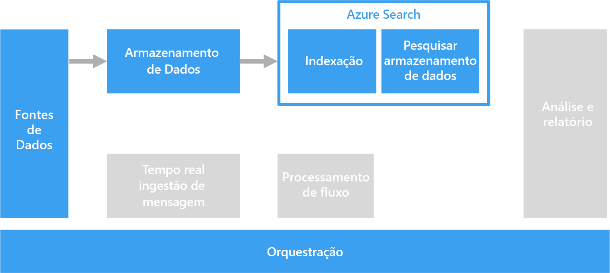

# Processando um texto de forma livre para pesquisaProcessing free-form text for search

Para dar suporte à pesquisa, o processamento de texto de forma livre pode ser executado em documentos que contêm parágrafos de texto.To support search, free-form text processing can be performed against documents containing paragraphs of text.

A pesquisa de texto funciona pela construção de um índice especializado que é pré-calculado em uma coleção de documentos.Text search works by constructing a specialized index that is precomputed against a collection of documents. Um aplicativo cliente envia uma consulta que contém os termos de pesquisa.A client application submits a query that contains the search terms. A consulta retorna um conjunto de resultados, que consiste em uma lista de documentos classificados pela precisão de correspondência de cada documento aos critérios de pesquisa.The query returns a result set, consisting of a list of documents sorted by how well each document matches the search criteria. O conjunto de resultados também pode incluir o contexto no qual o documento corresponde aos critérios, o que possibilita ao aplicativo realçar a frase correspondente no documento.The result set may also include the context in which the document matches the criteria, which enables the application to highlight the matching phrase in the document. 

O processamento de texto de forma livre pode produzir dados úteis e acionáveis com base em grandes quantidades de dados de texto com ruído.Free-form text processing can produce useful, actionable data from large amounts of noisy text data. Os resultados podem dar a documentos não estruturados uma estrutura bem definida e que pode ser consultada.The results can give unstructured documents a well-defined and queryable structure.

## DesafiosChallenges

- Normalmente, o processamento de uma coleção de documentos de texto de forma livre apresenta um uso computacionalmente intensivo, além de ser demorado.Processing a collection of free-form text documents is typically computationally intensive, as well as time intensive.
- Para pesquisar um texto de forma livre com eficiência, o índice de pesquisa deve dar suporte à pesquisa difusa, com base em termos que têm uma construção semelhante.In order to search free-form text effectively, the search index should support fuzzy search based on terms that have a similar construction. Por exemplo, os índices de pesquisa são criados com lematização e lematização linguística, de modo que as consultas de "correr" corresponderão a documentos que contêm "correu" e "correndo".For example, search indexes are built with lemmatization and linguistic stemming, so that queries for "run" will match documents that contain "ran" and "running."

## ArquiteturaArchitecture

Na maioria dos cenários, os documentos de texto de origem são carregados em um armazenamento de objetos, como o Armazenamento do Azure ou o Azure Data Lake Store.In most scenarios, the source text documents are loaded into object storage such as Azure Storage or Azure Data Lake Store. Uma exceção é o uso da pesquisa de texto completo no SQL Server ou no Banco de Dados SQL do Azure.An exception is using full text search within SQL Server or Azure SQL Database. Nesse caso, os dados de documentos são carregados em tabelas gerenciadas pelo banco de dados.In this case, the document data is loaded into tables managed by the database. Depois de armazenados, os documentos são processados em um lote para criar o índice.Once stored, the documents are processed in a batch to create the index.

## Opções de tecnologiaTechnology choices

Entre as opções para a criação de um índice de pesquisa estão o Azure Search, Elasticsearch e HDInsight com Solr.Options for creating a search index include Azure Search, Elasticsearch, and HDInsight with Solr. Cada uma dessas tecnologias pode popular um índice de pesquisa com base em uma coleção de documentos.Each of these technologies can populate a search index from a collection of documents. O Azure Search fornece indexadores que podem popular automaticamente o índice de documentos que variam de texto sem formatação a formatos do Excel e PDF.Azure Search provides indexers that can automatically populate the index for documents ranging from plain text to Excel and PDF formats. No HDInsight, o Apache Solr pode indexar arquivos binários de muitos tipos, incluindo texto sem formatação, Word e PDF.On HDInsight, Apache Solr can index binary files of many types, including plain text, Word, and PDF. Depois que o índice é construído, os clientes podem acessar a interface de pesquisa por meio de uma API REST.Once the index is constructed, clients can access the search interface by means of a REST API. 

Se os dados de texto estiverem armazenados no SQL Server ou no Banco de Dados SQL do Azure, use a pesquisa de texto completo criada no banco de dados.If your text data is stored in SQL Server or Azure SQL Database, you can use the full-text search that is built into the database. O banco de dados popula o índice com base nos dados de texto, binários ou XML armazenados no mesmo banco de dados.The database populates the index from text, binary, or XML data stored within the same database. Os clientes pesquisam por meio de consultas T-SQL.Clients search by using T-SQL queries. 

Para obter mais informações, consulte [Armazenamentos de dados de pesquisa](../technology-choices/search-options.md).For more information, see [Search data stores](../technology-choices/search-options.md).
