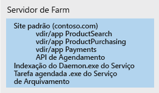
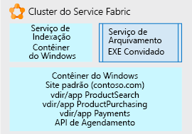

# Usar o Service Fabric para decompor aplicativos monolíticos

Neste cenário de exemplo, explicamos uma abordagem usando o [Service Fabric](/azure/service-fabric/service-fabric-overview) como uma plataforma para decomposição de um aplicativo monolítico complicado. Consideramos uma abordagem iterativa para decomposição de um site do IIS/ASP.NET em um aplicativo composto por vários microsserviços gerenciáveis.

A movimentação de uma arquitetura monolítica para uma arquitetura de microsserviço oferece os seguintes benefícios:

- Você pode alterar uma unidade de código pequena e legível e implantar apenas essa unidade.
- Cada unidade de código requer apenas alguns minutos ou menos para a implantação.
- Se houver um erro nessa unidade pequena, somente essa unidade deixará de funcionar, não o aplicativo inteiro.
- As pequenas unidades de código podem ser distribuídas separadamente e com facilidade entre várias equipes de desenvolvimento.
- Os novos desenvolvedores podem entender a funcionalidade distinta de cada unidade com rapidez e facilidade.

Um aplicativo grande do IIS em um farm de servidores é usado neste exemplo, mas os conceitos de decomposição iterativa e hospedagem podem ser usados para qualquer tipo de aplicativo grande. Embora essa solução use o Windows, o Service Fabric também pode ser executado no Linux. Ele pode ser executado no local, no Azure ou em nós de VM no provedor de nuvem de sua escolha.

## Casos de uso relevantes

Esse cenário é relevante para organizações com grandes aplicativos Web monolíticos que estão enfrentando:

- Erros em pequenas alterações de código que causam interrupção de todo o site.
- Lançamentos que levam vários dias devido à necessidade de lançar uma atualização para todo o site.
- Longo tempo de adaptação ao integrar novos desenvolvedores ou equipes devido a uma base de código complexa, exigindo que um único indivíduo saiba mais do que é viável.

## Arquitetura

Usando o Service Fabric como a plataforma de hospedagem, podemos converter um site do IIS grande em uma coleção de microsserviços, conforme mostrado abaixo:

Na figura acima, decompusemos todas as partes de um aplicativo IIS grande em:

- Um serviço de roteamento ou de gateway que aceita solicitações recebidas do navegador, analisa-os para determinar quais serviços devem lidar com eles e encaminha a solicitação para esse serviço.
- Quatro aplicativos ASP.NET Core que eram formalmente diretórios virtuais sob o site único do IIS em execução como aplicativos ASP.NET. Os aplicativos foram separados em seus próprios microsserviços independentes. Assim, eles podem ser alterados, ter controle de versão e ser atualizados separadamente. Neste exemplo, reescrevemos cada aplicativo usando o .Net Core e o ASP.NET Core. Eles foram escritos como [Reliable Services](/azure/service-fabric/service-fabric-reliable-services-introduction) para que possam acessar nativamente os recursos e os benefícios completos da plataforma do Service Fabric (serviços de comunicação, relatórios de integridade, notificações etc.).
- Um serviço do Windows chamado *Serviço de Indexação*, colocado em um contêiner do Windows para que ele não faça mais alterações diretas no registro do servidor subjacente, mas pode ser executado de forma autossuficiente e ser implantado com todas as suas dependências como uma unidade.
- Um serviço de Arquivo Morto, que é simplesmente um executável que é executado de acordo com uma agenda e executa algumas tarefas para os sites. Ele é hospedado diretamente como um executável autônomo, pois determinamos que ele faz o que precisa fazer sem modificação, e o investimento para alteração não se justifica.

## Considerações

O primeiro desafio é começar a identificar bits menores de código que possam ser fatorados do monólito em microsserviços que o monólito possa chamar. Iterativamente ao longo do tempo, o monolito é dividido em uma coleção de microsserviços que os desenvolvedores podem facilmente entender, alterar e implantar rapidamente com baixo risco.

O Service Fabric foi escolhido porque é capaz de dar suporte à execução de todos os microsserviços em suas várias formas. Por exemplo, você pode ter uma mistura de executáveis autônomos, novos sites pequenos, novas APIs pequenas e serviços em contêineres etc. O Service Fabric pode combinar todos esses tipos de serviço em um único cluster.

Para obter esse aplicativo decomposto final, usamos uma abordagem iterativa. Começamos com um grande site do IIS/ASP.NET em um farm de servidores. Um único nó do farm do servidor é mostrado abaixo. Ele contém o site original com vários diretórios virtuais, um serviço do Windows adicional que o site chama e um executável que faz a manutenção de arquivo morto periódica de site.

Na primeira iteração de desenvolvimento, o site do IIS e seus diretórios virtuais são colocados em um [contêiner do Windows](/azure/service-fabric/service-fabric-containers-overview). Isso permite que o site permaneça operacional, mas não rigidamente vinculado ao nó do servidor do sistema operacional subjacente. O contêiner é executado e orquestrado pelo nó do Service Fabric subjacente, mas o nó não precisa ter qualquer estado do qual o site dependa (entradas do Registro, arquivos etc.). Todos esses itens estão no contêiner. Também colocamos o serviço de indexação em um contêiner do Windows, pelas mesmas razões. Os contêineres podem ser implantados, ter controle de versão e ser dimensionados de forma independente. Por fim, hospedamos o Serviço de Arquivo em um [arquivo executável autônomo](/azure/service-fabric/service-fabric-guest-executables-introduction) simples, pois é um .exe independente sem requisitos especiais.

A figura a seguir mostra como nosso site grande agora é parcialmente decomposto em unidades independentes e fica pronto para ser decomposto ainda mais, conforme o tempo permitir.

O desenvolvimento posterior se concentra em separar o contêiner único de site grande padrão mostrado acima. Cada um dos aplicativos ASP.NET do diretório virtual é removido do contêiner, um de cada vez, e movido para [serviços confiáveis](/azure/service-fabric/service-fabric-reliable-services-introduction) do ASP.NET Core.

Depois que cada um dos diretórios virtuais é fatorado, o site padrão é escrito como um serviço confiável do ASP.NET Core, que aceita solicitações de navegador de entrada e as encaminha para o aplicativo ASP.NET correto.

### Disponibilidade, escalabilidade e segurança

O Service Fabric é [capaz de dar suporte a várias formas de microsserviços](/azure/service-fabric/service-fabric-choose-framework), mantendo as chamadas entre elas no mesmo cluster de forma simples e rápida. O Service Fabric é um cluster [tolerante a falhas](/azure/service-fabric/service-fabric-availability-services) e com autorrecuperação que pode executar contêineres, executáveis e até mesmo tem uma API nativa para gravar microsserviços diretamente nele (o 'Reliable Services' mencionado acima). A plataforma facilita a distribuição de atualizações e o controle de versão de cada microsserviço. Você pode informar a plataforma para executar mais ou menos de qualquer microsserviço distribuído no cluster do Service Fabric para [dimensionar](/azure/service-fabric/service-fabric-concepts-scalability) apenas os microsserviços de que precisa.

O Service Fabric é um cluster fundamentado em uma infraestrutura de nós virtuais (ou físicos), que têm recursos de rede, armazenamento e um sistema operacional. Assim, ele tem um conjunto de tarefas administrativas, de manutenção e de monitoramento.

Considere também a governança e o controle do cluster. Assim como você não desejaria que pessoas implantassem arbitrariamente bancos de dados em seu servidor de banco de dados de produção, também não desejaria que implantassem aplicativos no cluster do Service Fabric sem supervisão.

O Service Fabric é capaz de hospedar muitos [cenários de aplicativo](/azure/service-fabric/service-fabric-application-scenarios) diferentes. Reserve algum tempo para determinar quais deles se aplicam a seu cenário.

## Preços

Para um cluster do Service Fabric hospedado no Azure, a maior parte do custo corresponde ao número e ao tamanho de nós no cluster. O Azure permite a criação rápida e simples de um cluster composto do tamanho de nó subjacente especificado, mas os encargos de computação são baseados no tamanho do nó multiplicado pelo número de nós.

Outros componentes mais baratos são os encargos de armazenamento para discos virtuais de cada nó e os encargos de saída de E/S de rede do Azure (por exemplo, tráfego de rede saindo do Azure para o navegador do usuário).

Para ter uma ideia do custo, criamos um exemplo que usa alguns valores padrão de tamanho de cluster, rede e armazenamento: Examine a [calculadora de preços](https://azure.com/e/52dea096e5844d5495a7b22a9b2ccdde). Fique à vontade atualizar os valores na calculadora padrão para os valores relevantes à sua situação.

## Próximas etapas

Reserve algum tempo para se familiarizar com a plataforma examinando a [documentação](/azure/service-fabric/service-fabric-overview) e os vários [cenários de aplicativo](/azure/service-fabric/service-fabric-application-scenarios) diferentes para o Service Fabric. A documentação informará em que consiste um cluster, onde ele pode ser executado, a arquitetura de software e a manutenção para ele.

Para ver uma demonstração do Service Fabric para um aplicativo .NET existente, implante o [início rápido](/azure/service-fabric/service-fabric-quickstart-dotnet) do Service Fabric.

Do ponto de vista do aplicativo atual, comece a pensar sobre suas diferentes funções. Escolha um deles e pense em como você pode separar apenas essa função do todo. Examine uma parte separada e compreensível por vez.

## Recursos relacionados

- [Como criar microsserviços no Azure](/azure/architecture/microservices)
- [Visão geral do Service Fabric](/azure/service-fabric/service-fabric-overview)
- [Modelo de programação do Service Fabric](/azure/service-fabric/service-fabric-choose-framework)
- [Disponibilidade do Service Fabric](/azure/service-fabric/service-fabric-availability-services)
- [Dimensionamento do Service Fabric](/azure/service-fabric/service-fabric-concepts-scalability)
- [Hospedagem de contêineres no Service Fabric](/azure/service-fabric/service-fabric-containers-overview)
- [Hospedagem de executáveis autônomos no Service Fabric](/azure/service-fabric/service-fabric-guest-executables-introduction)
- [Reliable Services nativos do Service Fabric](/azure/service-fabric/service-fabric-reliable-services-introduction)
- [Cenários de aplicativos do Service Fabric](/azure/service-fabric/service-fabric-application-scenarios)