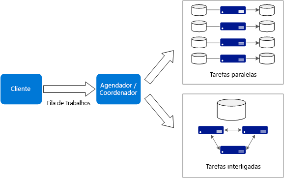
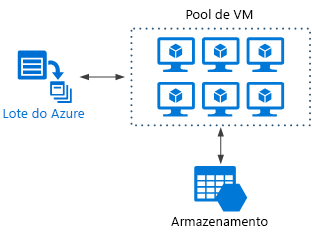

# Estilo de arquitetura de computação intensa

O termo *computação intensa* descreve as cargas de trabalho em grande escala que exigem uma grande quantidade de núcleos, geralmente centenas ou milhares deles. Entre os cenários, temos renderização de imagem, dinâmica de fluidos, modelagem de riscos financeiros, exploração de petróleo, concepção de medicamentos e análise de estresse de engenharia, entre outros.

Estas são algumas características comuns de aplicativos de computação intensa:

- O trabalho pode ser dividido em tarefas discretas, as quais podem ser executadas simultaneamente em vários núcleos.
- Cada tarefa é finita. É preciso de alguma entrada, algum processamento é executado e se produz uma saída. O aplicativo como um todo é executado por uma quantidade finita de tempo (de minutos a dias). Um padrão comum é provisionar uma grande quantidade de núcleos com um disparo contínuo e depois diminuir até zero assim que o aplicativo concluir. 
- O aplicativo não precisa ficar ativo 24/7. No entanto, o sistema deve tratar as falhas de nó ou panes do aplicativo.
- Para alguns aplicativos, as tarefas são independentes e podem ser executados em paralelo. Em outros casos, as tarefas estão firmemente acopladas, o que significa que elas devem interagir ou trocar resultados intermediários. Nesse caso, leve em consideração o uso de tecnologias de rede de alta velocidade, como InfiniBand e RDMA (acesso remoto direto à memória). 
- Dependendo da sua carga de trabalho, é possível usar os tamanhos de VM de computação intensiva (H16r, H16mr e A9).

## Quando usar essa arquitetura

- Operações computacionalmente intensivas, como simulações e processamentos de números.
- Simulações são computacionalmente intensivas e devem ser divididas entre CPUs de vários computadores (dezenas a milhares).
- Simulações que requerem muita memória para um computador e devem ser divididas entre vários computadores.
- Cálculos de longa execução que levariam muito tempo para serem concluídos em um único computador.
- Computações menores que devem ser executadas centenas ou milhares de vezes, como simulações de Monte Carlo.

## Benefícios

- Alto desempenho com processamento “[embaraçosamente paralelo][embarrassingly-parallel]”.
- Pode aproveitar centenas ou milhares de núcleos de computador para solucionar grandes problemas com mais rapidez.
- Acesso a hardware especializado de alto desempenho e com redes de alta velocidade InfiniBand dedicadas.
- Você pode provisionar quantas VMs forem necessárias para trabalhar e depois subdividi-las. 

## Desafios

- Gerenciar a infraestrutura da VM.
- Gerenciar o volume de processamento de números. 
- Provisionar milhares de núcleos em tempo hábil.
- Para tarefas firmemente acopladas, a adição de mais núcleos pode levar à diminuição de retornos. Talvez seja preciso fazer experimentos para encontrar a quantidade ideal de núcleos.

## Computação intensa usando o Lote do Azure

O [Lote do Azure][batch] é um serviço gerenciado para execução de aplicativos HPC (computação de alto desempenho) em grande escala.

Ao usar o Lote do Azure, você configura um pool de VMs e carrega os aplicativos e os arquivos de dados. Depois o serviço do Lote provisiona as VMs, atribui tarefas às VMs, executa as tarefas e monitora o progresso. O Lote pode se escalar horizontal e automaticamente as VMs em resposta à carga de trabalho. O Lote também fornece o agendamento de trabalho.

 

## Computação intensa em execução em Máquinas Virtuais

Você pode usar [Microsoft HPC Pack][hpc-pack] para administrar um cluster de VMs, além de agendar e monitorar trabalhos de HPC. Com essa abordagem, é preciso provisionar e gerenciar a infraestrutura das VMs e da rede. Leve essa abordagem em consideração se você tiver cargas de trabalho de HPC existentes e quiser mover algumas ou todas elas para o Azure. É possível mover todo o cluster de HPC para o Azure ou manter o cluster de HPC local, mas usar o Azure para a capacidade de disparo contínuo. Para obter mais informações, confira [Soluções HPC e Lote para cargas de trabalho de computação em larga escala][batch-hpc-solutions].

### HPC Pack implantado no Azure

Nesse cenário, o cluster de HPC é criado inteiramente dentro do Azure.

 
 
O nó principal fornece os serviços de gerenciamento e de agendamento de trabalho para o cluster. Para tarefas firmemente acopladas, use uma rede de RDMA que forneça comunicação entre máquinas virtuais com largura de banda muito alta e baixa latência. Para obter mais informações, confira [Implantar um cluster de HPC Pack 2016 no Azure][deploy-hpc-azure].

### Fazer disparo contínuo de um cluster HPC para o Azure

Nesse cenário, uma organização está executando o HPC Pack local e usa as VMs do Azure para a capacidade de disparo. O nó principal do cluster é local. O ExpressRoute ou Gateway de VPN conecta rede local à VNet do Azure.

 

[batch]: /azure/batch/
[batch-hpc-solutions]: /azure/batch/batch-hpc-solutions
[deploy-hpc-azure]: /azure/virtual-machines/windows/hpcpack-2016-cluster
[embarrassingly-parallel]: https://en.wikipedia.org/wiki/Embarrassingly_parallel
[hpc-pack]: https://technet.microsoft.com/library/cc514029

 
