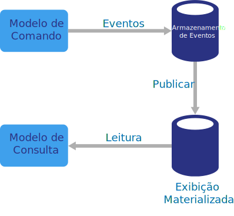
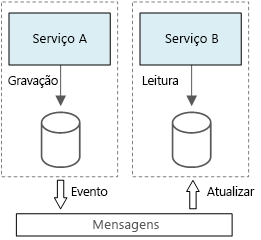

# Estilo de arquitetura CQRSCQRS architecture style

O CQRS (Command and Query Responsibility Segregation) é um estilo de arquitetura que separa operações de leitura de operações de gravação.Command and Query Responsibility Segregation (CQRS) is an architecture style that separates read operations from write operations.

Nas arquiteturas tradicionais, o mesmo modelo de dados é usado para consultar e atualizar um banco de dados.In traditional architectures, the same data model is used to query and update a database. É simples e funciona bem para operações CRUD básicas.That's simple and works well for basic CRUD operations. Em aplicativos mais complexos, no entanto, essa abordagem pode se tornar complicada.In more complex applications, however, this approach can become unwieldy. Por exemplo, no lado de leitura, o aplicativo pode executar muitas consultas diferentes, retornando objetos de transferência de dados (DTOs) com formas diferentes.For example, on the read side, the application may perform many different queries, returning data transfer objects (DTOs) with different shapes. O mapeamento de objetos pode se tornar complicado.Object mapping can become complicated. No lado da gravação, o modelo pode implementar uma validação complexa e lógica de negócios.On the write side, the model may implement complex validation and business logic. Como resultado, você pode terminar com um modelo excessivamente complexo que faz coisas em excesso.As a result, you can end up with an overly complex model that does too much.

Outro problema potencial é que a leitura e a gravação de cargas de trabalho geralmente são assimétricas, com diferentes requisitos de desempenho e escalabilidade.Another potential problem is that read and write workloads are often asymmetrical, with very different performance and scale requirements.

O CQRS trata desses problemas, separando as leituras e gravações em modelos separados, usando **comandos** para atualizar dados e **consultas** para ler dados.CQRS addresses these problems by separating reads and writes into separate models, using **commands** to update data, and **queries** to read data.

- Os comandos devem ser baseados em tarefas, em vez de centrados nos dados.Commands should be task based, rather than data centric. Os comandos ("Book hotel room," not "set ReservationStatus to Reserved.") podem ser posicionados em uma fila para processamento assíncrono, em vez de ser processado de forma síncrona.("Book hotel room," not "set ReservationStatus to Reserved.") Commands may be placed on a queue for asynchronous processing, rather than being processed synchronously.

- As consultas nunca modificam o banco de dados.Queries never modify the database. Uma consulta retorna um DTO que não encapsula qualquer conhecimento de domínio.A query returns a DTO that does not encapsulate any domain knowledge.

Para maior isolamento, você pode separar fisicamente os dados de leitura de dados de gravação.For greater isolation, you can physically separate the read data from the write data. Nesse caso, o banco de dados de leitura pode usar seu próprio esquema de dados, otimizado para consultas.In that case, the read database can use its own data schema that is optimized for queries. Por exemplo, ele pode armazenar uma [exibição materializada][materialized-view] dos dados, para evitar mapeamentos de O/RM complexos ou junções complexas.For example, it can store a [materialized view][materialized-view] of the data, in order to avoid complex joins or complex O/RM mappings. Ele ainda pode usar um tipo diferente de armazenamento de dados.It might even use a different type of data store. Por exemplo, o banco de dados de gravação pode ser relacional, enquanto o banco de dados de leitura é um banco de dados de documento.For example, the write database might be relational, while the read database is a document database.

Se os bancos de dados de leitura e gravação separados forem usados, deverão ser mantidos em sincronia. Normalmente, isso é feito com a publicação de um evento pelo modelo de gravação sempre que ele atualiza o banco de dados de publicação.If separate read and write databases are used, they must be kept in sync. Typically this is accomplished by having the write model publish an event whenever it updates the database. A atualização do banco de dados e a publicação do evento devem ocorrer em uma única transação.Updating the database and publishing the event must occur in a single transaction.

Algumas implementações do CQRS usam o [padrão de Evento de Fornecimento][event-sourcing].Some implementations of CQRS use the [Event Sourcing pattern][event-sourcing]. Com esse padrão, o estado do aplicativo é armazenado como uma sequência de eventos.With this pattern, application state is stored as a sequence of events. Cada evento representa um conjunto de alterações nos dados.Each event represents a set of changes to the data. O estado atual foi criado pela repetição dos eventos.The current state is constructed by replaying the events. Em um contexto CQRS, um dos benefícios do fornecimento do evento é que os mesmos eventos podem ser usados para notificar outros componentes &mdash; em particular, para notificar o modelo de leitura.In a CQRS context, one benefit of Event Sourcing is that the same events can be used to notify other components &mdash; in particular, to notify the read model. O modelo de leitura usa os eventos para criar um instantâneo do estado atual, que é mais eficiente para consultas.The read model uses the events to create a snapshot of the current state, which is more efficient for queries. No entanto, o fornecimento de evento adiciona complexidade ao design.However, Event Sourcing adds complexity to the design.

## Quando usar essa arquiteturaWhen to use this architecture

Considere o CQRS para domínios colaborativos em que muitos usuários acessem os mesmos dados, especialmente quando as cargas de trabalho de leitura e gravação forem assimétricas.Consider CQRS for collaborative domains where many users access the same data, especially when the read and write workloads are asymmetrical.

O CQRS não é uma arquitetura de nível superior que se aplica ao sistema inteiro.CQRS is not a top-level architecture that applies to an entire system. Aplique o CQRS somente a esses subsistemas onde houver um valor claro na separação de leituras e gravações.Apply CQRS only to those subsystems where there is clear value in separating reads and writes. Caso contrário, você estará criando uma complexidade adicional sem nenhum benefício.Otherwise, you are creating additional complexity for no benefit.

## BenefíciosBenefits

- **Dimensionamento independente**.**Independently scaling**. O CQRS permite que as cargas de trabalho de leitura e gravação sejam dimensionadas de forma independente e pode resultar em menos contenções de bloqueio.CQRS allows the read and write workloads to scale independently, and may result in fewer lock contentions.
- **Esquemas de dados otimizados**.**Optimized data schemas**. O lado de leitura pode usar um esquema que é otimizado para consultas, enquanto o lado de gravação usa um esquema que é otimizado para atualizações.The read side can use a schema that is optimized for queries, while the write side uses a schema that is optimized for updates.
- **Segurança**.**Security**. É mais fácil garantir que apenas as entidades do direito de domínio estejam executando gravações nos dados.It's easier to ensure that only the right domain entities are performing writes on the data.
- **Separação de preocupações**.**Separation of concerns**. Isolar os lados de leitura e gravação pode resultar em modelos mais flexíveis e sustentáveis.Segregating the read and write sides can result in models that are more maintainable and flexible. A maior parte da lógica de negócios complexa vai para o modelo de gravação.Most of the complex business logic goes into the write model. O modelo de leitura pode ser relativamente simples.The read model can be relatively simple.
- **Consultas mais simples**.**Simpler queries**. Ao armazenar uma exibição materializada no banco de dados de leitura, o aplicativo poderá evitar junções complexas durante as consultas.By storing a materialized view in the read database, the application can avoid complex joins when querying.

## DesafiosChallenges

- **Complexidade**.**Complexity**. A ideia básica do CQRS é simples.The basic idea of CQRS is simple. Mas isso poderá resultar em um design de aplicativo mais complexo, especialmente se eles incluírem o padrão Fornecimento de Eventos.But it can lead to a more complex application design, especially if they include the Event Sourcing pattern.

- **Mensagens**.**Messaging**. Embora o CQRS não necessite de mensagens, é comum usar mensagens para comandos de processo e publicar eventos de atualização.Although CQRS does not require messaging, it's common to use messaging to process commands and publish update events. Neste caso, o aplicativo deve tratar as falhas de mensagem ou as mensagens duplicadas.In that case, the application must handle message failures or duplicate messages.

- **Consistência eventual**.**Eventual consistency**. Se você separar os bancos de dados de leitura e de gravação, os dados de leitura poderão ficar obsoletos.If you separate the read and write databases, the read data may be stale.

## Práticas recomendadasBest practices

- Para saber mais sobre como implementar o CQRS, confira o [padrão CQRS][cqrs-pattern].For more information about implementing CQRS, see the [CQRS pattern][cqrs-pattern].

- Considere o uso do padrão [Fornecimento de Evento][event-sourcing] para evitar conflitos de atualização.Consider using the [Event Sourcing][event-sourcing] pattern to avoid update conflicts.

- Considere o uso do [padrão Exibição Materializada][materialized-view] para o modelo de leitura para otimizar o esquema para consultas.Consider using the [Materialized View pattern][materialized-view] for the read model, to optimize the schema for queries.

## CQRS em microsserviçosCQRS in microservices

O CQRS pode ser especialmente útil em uma [arquitetura de microsserviços][microservices].CQRS can be especially useful in a [microservices architecture][microservices]. Um dos princípios de microsserviços é que um serviço não pode acessar diretamente o armazenamento de dados do outro serviço.One of the principles of microservices is that a service cannot directly access another service's data store.

No diagrama a seguir, o Serviço A grava em um armazenamento de dados e o Serviço B mantém uma exibição materializada dos dados.In the following diagram, Service A writes to a data store, and Service B keeps a materialized view of the data. Um serviço publica um evento sempre que ele grava no armazenamento de dados.Service A publishes an event whenever it writes to the data store. O Serviço B assina o evento.Service B subscribes to the event.

<!-- links -->

[cqrs-pattern]: ../../patterns/cqrs.md
[event-sourcing]: ../../patterns/event-sourcing.md
[materialized-view]: ../../patterns/materialized-view.md
[microservices]: ./microservices.md
