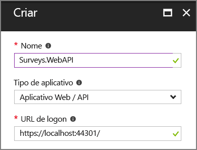
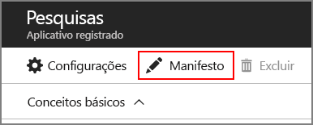
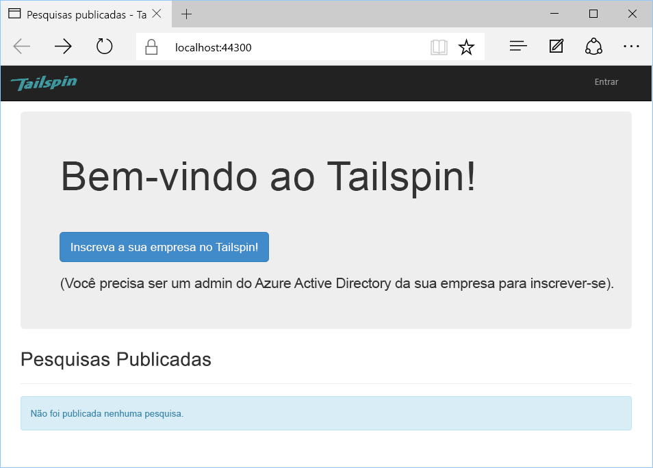
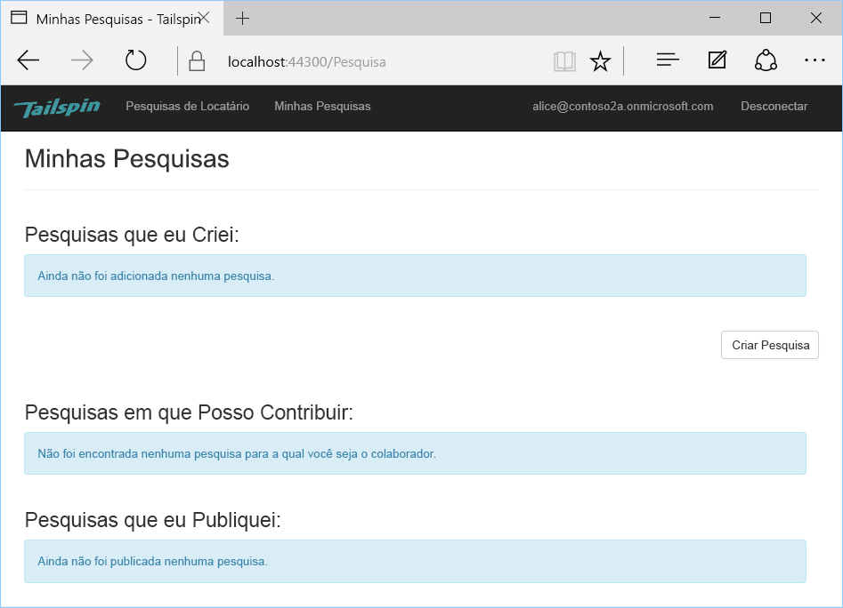

# <a name="run-the-surveys-application"></a><span data-ttu-id="2dc89-103">Executar o aplicativo Surveys</span><span class="sxs-lookup"><span data-stu-id="2dc89-103">Run the Surveys application</span></span>

<span data-ttu-id="2dc89-104">Este artigo descreve como executar o aplicativo [Tailspin Surveys](./tailspin.md) localmente usando o Visual Studio.</span><span class="sxs-lookup"><span data-stu-id="2dc89-104">This article describes how to run the [Tailspin Surveys](./tailspin.md) application locally, from Visual Studio.</span></span> <span data-ttu-id="2dc89-105">Nestas etapas, você não implantará o aplicativo no Azure.</span><span class="sxs-lookup"><span data-stu-id="2dc89-105">In these steps, you won't deploy the application to Azure.</span></span> <span data-ttu-id="2dc89-106">No entanto, você precisará criar alguns recursos do Azure &mdash; um diretório do Azure AD (Azure Active Directory) e um cache Redis.</span><span class="sxs-lookup"><span data-stu-id="2dc89-106">However, you will need to create some Azure resources &mdash; an Azure Active Directory (Azure AD) directory and a Redis cache.</span></span>

<span data-ttu-id="2dc89-107">Aqui está um resumo das etapas:</span><span class="sxs-lookup"><span data-stu-id="2dc89-107">Here is a summary of the steps:</span></span>

1. <span data-ttu-id="2dc89-108">Criar um diretório do Azure AD (locatário) para a empresa fictícia Tailspin.</span><span class="sxs-lookup"><span data-stu-id="2dc89-108">Create an Azure AD directory (tenant) for the fictitious Tailspin company.</span></span>
2. <span data-ttu-id="2dc89-109">Registrar o aplicativo Surveys e a API Web de back-end com o Azure AD.</span><span class="sxs-lookup"><span data-stu-id="2dc89-109">Register the Surveys application and the backend web API with Azure AD.</span></span>
3. <span data-ttu-id="2dc89-110">Criar uma instância do Cache Redis do Azure.</span><span class="sxs-lookup"><span data-stu-id="2dc89-110">Create an Azure Redis Cache instance.</span></span>
4. <span data-ttu-id="2dc89-111">Definir as configurações de aplicativo e criar um banco de dados local.</span><span class="sxs-lookup"><span data-stu-id="2dc89-111">Configure application settings and create a local database.</span></span>
5. <span data-ttu-id="2dc89-112">Executar o aplicativo e inscrever um novo locatário.</span><span class="sxs-lookup"><span data-stu-id="2dc89-112">Run the application and sign up a new tenant.</span></span>
6. <span data-ttu-id="2dc89-113">Adicione funções de aplicativo aos usuários.</span><span class="sxs-lookup"><span data-stu-id="2dc89-113">Add application roles to users.</span></span>

## <a name="prerequisites"></a><span data-ttu-id="2dc89-114">Pré-requisitos</span><span class="sxs-lookup"><span data-stu-id="2dc89-114">Prerequisites</span></span>

- <span data-ttu-id="2dc89-115">[Visual Studio 2017] [ VS2017] com a [carga de trabalho ASP.NET e desenvolvimento Web](https://visualstudio.microsoft.com/vs/support/selecting-workloads-visual-studio-2017) instalada</span><span class="sxs-lookup"><span data-stu-id="2dc89-115">[Visual Studio 2017][VS2017] with the [ASP.NET and web development workload](https://visualstudio.microsoft.com/vs/support/selecting-workloads-visual-studio-2017) installed</span></span>
- <span data-ttu-id="2dc89-116">Conta do [Microsoft Azure](https://azure.microsoft.com)</span><span class="sxs-lookup"><span data-stu-id="2dc89-116">[Microsoft Azure](https://azure.microsoft.com) account</span></span>

## <a name="create-the-tailspin-tenant"></a><span data-ttu-id="2dc89-117">Criar o locatário Tailspin</span><span class="sxs-lookup"><span data-stu-id="2dc89-117">Create the Tailspin tenant</span></span>

<span data-ttu-id="2dc89-118">Tailspin é a empresa fictícia que hospeda o aplicativo Surveys.</span><span class="sxs-lookup"><span data-stu-id="2dc89-118">Tailspin is the fictitious company that hosts the Surveys application.</span></span> <span data-ttu-id="2dc89-119">A Tailspin usa o Azure AD para habilitar outros locatários para registro com o aplicativo.</span><span class="sxs-lookup"><span data-stu-id="2dc89-119">Tailspin uses Azure AD to enable other tenants to register with the app.</span></span> <span data-ttu-id="2dc89-120">Esses clientes então podem usar as credenciais do Azure AD para entrar no aplicativo.</span><span class="sxs-lookup"><span data-stu-id="2dc89-120">Those customers can then use their Azure AD credentials to sign into the app.</span></span>

<span data-ttu-id="2dc89-121">Nesta etapa, você criará um diretório do Azure AD para Tailspin.</span><span class="sxs-lookup"><span data-stu-id="2dc89-121">In this step, you'll create an Azure AD directory for Tailspin.</span></span>

1. <span data-ttu-id="2dc89-122">Faça logon no [Portal do Azure][portal].</span><span class="sxs-lookup"><span data-stu-id="2dc89-122">Sign into the [Azure portal][portal].</span></span>

2. <span data-ttu-id="2dc89-123">Clique em **+ Criar um Recurso** > **Identidade** > **Azure Active Directory**.</span><span class="sxs-lookup"><span data-stu-id="2dc89-123">Click **+ Create a Resource** > **Identity** > **Azure Active Directory**.</span></span>

3. <span data-ttu-id="2dc89-124">Digite `Tailspin` para o nome da organização e insira um nome de domínio.</span><span class="sxs-lookup"><span data-stu-id="2dc89-124">Enter `Tailspin` for the organization name, and enter a domain name.</span></span> <span data-ttu-id="2dc89-125">O nome de domínio terá o formato `xxxx.onmicrosoft.com` e deverá ser globalmente exclusivo.</span><span class="sxs-lookup"><span data-stu-id="2dc89-125">The domain name will have the form `xxxx.onmicrosoft.com` and must be globally unique.</span></span>

    

4. <span data-ttu-id="2dc89-127">Clique em **Criar**.</span><span class="sxs-lookup"><span data-stu-id="2dc89-127">Click **Create**.</span></span> <span data-ttu-id="2dc89-128">A criação do novo diretório pode levar alguns minutos.</span><span class="sxs-lookup"><span data-stu-id="2dc89-128">It may take a few minutes to create the new directory.</span></span>

<span data-ttu-id="2dc89-129">Para completar o cenário de ponta a ponta, você precisará de um segundo diretório do Azure AD para representar um cliente que se inscreva para o aplicativo.</span><span class="sxs-lookup"><span data-stu-id="2dc89-129">To complete the end-to-end scenario, you'll need a second Azure AD directory to represent a customer that signs up for the application.</span></span> <span data-ttu-id="2dc89-130">Você pode usar o diretório do Azure AD padrão (não Tailspin) ou criar um novo diretório para essa finalidade.</span><span class="sxs-lookup"><span data-stu-id="2dc89-130">You can use your default Azure AD directory (not Tailspin), or create a new directory for this purpose.</span></span> <span data-ttu-id="2dc89-131">Os exemplos, usamos Contoso como o cliente fictício.</span><span class="sxs-lookup"><span data-stu-id="2dc89-131">In the examples, we use Contoso as the fictitious customer.</span></span>

## <a name="register-the-surveys-web-api"></a><span data-ttu-id="2dc89-132">Registrar a API web do Surveys</span><span class="sxs-lookup"><span data-stu-id="2dc89-132">Register the Surveys web API</span></span>

1. <span data-ttu-id="2dc89-133">No [portal do Azure][portal], mude para o novo diretório Tailspin selecionando sua conta no canto superior direito do portal.</span><span class="sxs-lookup"><span data-stu-id="2dc89-133">In the [Azure portal][portal], switch to the new Tailspin directory by selecting your account in the top right corner of the portal.</span></span>

2. <span data-ttu-id="2dc89-134">No painel de navegação esquerdo, escolha **Azure Active Directory**.</span><span class="sxs-lookup"><span data-stu-id="2dc89-134">In the left-hand navigation pane, choose **Azure Active Directory**.</span></span>

3. <span data-ttu-id="2dc89-135">Clique em **Registros do aplicativo** > **Novo registro de aplicativo**.</span><span class="sxs-lookup"><span data-stu-id="2dc89-135">Click **App registrations** > **New application registration**.</span></span>

4. <span data-ttu-id="2dc89-136">Na folha **Criar**, insira as seguintes informações:</span><span class="sxs-lookup"><span data-stu-id="2dc89-136">In the **Create** blade, enter the following information:</span></span>

   - <span data-ttu-id="2dc89-137">**Nome**: `Surveys.WebAPI`</span><span class="sxs-lookup"><span data-stu-id="2dc89-137">**Name**: `Surveys.WebAPI`</span></span>

   - <span data-ttu-id="2dc89-138">**Tipo de Aplicativo**: `Web app / API`</span><span class="sxs-lookup"><span data-stu-id="2dc89-138">**Application type**: `Web app / API`</span></span>

   - <span data-ttu-id="2dc89-139">**URL de logon**: `https://localhost:44301/`</span><span class="sxs-lookup"><span data-stu-id="2dc89-139">**Sign-on URL**: `https://localhost:44301/`</span></span>

   

5. <span data-ttu-id="2dc89-141">Clique em **Criar**.</span><span class="sxs-lookup"><span data-stu-id="2dc89-141">Click **Create**.</span></span>

6. <span data-ttu-id="2dc89-142">Na folha **Registros do aplicativo**, selecione o novo aplicativo **Surveys.WebAPI**.</span><span class="sxs-lookup"><span data-stu-id="2dc89-142">In the **App registrations** blade, select the new **Surveys.WebAPI** application.</span></span>

7. <span data-ttu-id="2dc89-143">Em seguida, clique em **Configurações** > **Propriedades**.</span><span class="sxs-lookup"><span data-stu-id="2dc89-143">Click **Settings** > **Properties**.</span></span>

8. <span data-ttu-id="2dc89-144">Na caixa de edição **URI da ID do aplicativo**, digite `https://<domain>/surveys.webapi`, em que `<domain>` é o nome de domínio do diretório.</span><span class="sxs-lookup"><span data-stu-id="2dc89-144">In the **App ID URI** edit box, enter `https://<domain>/surveys.webapi`, where `<domain>` is the domain name of the directory.</span></span> <span data-ttu-id="2dc89-145">Por exemplo: `https://tailspin.onmicrosoft.com/surveys.webapi`</span><span class="sxs-lookup"><span data-stu-id="2dc89-145">For example: `https://tailspin.onmicrosoft.com/surveys.webapi`</span></span>

    

9. <span data-ttu-id="2dc89-147">Defina **Multilocatário** como **SIM**.</span><span class="sxs-lookup"><span data-stu-id="2dc89-147">Set **Multi-tenanted** to **YES**.</span></span>

10. <span data-ttu-id="2dc89-148">Clique em **Salvar**.</span><span class="sxs-lookup"><span data-stu-id="2dc89-148">Click **Save**.</span></span>

## <a name="register-the-surveys-web-app"></a><span data-ttu-id="2dc89-149">Registrar o aplicativo Web Surveys</span><span class="sxs-lookup"><span data-stu-id="2dc89-149">Register the Surveys web app</span></span>

1. <span data-ttu-id="2dc89-150">Navegue de volta para a folha **Registros do aplicativo** e clique em **Novo registro de aplicativo**.</span><span class="sxs-lookup"><span data-stu-id="2dc89-150">Navigate back to the **App registrations** blade, and click **New application registration**.</span></span>

2. <span data-ttu-id="2dc89-151">Na folha **Criar**, insira as seguintes informações:</span><span class="sxs-lookup"><span data-stu-id="2dc89-151">In the **Create** blade, enter the following information:</span></span>

    - <span data-ttu-id="2dc89-152">**Nome**: `Surveys`</span><span class="sxs-lookup"><span data-stu-id="2dc89-152">**Name**: `Surveys`</span></span>
    - <span data-ttu-id="2dc89-153">**Tipo de Aplicativo**: `Web app / API`</span><span class="sxs-lookup"><span data-stu-id="2dc89-153">**Application type**: `Web app / API`</span></span>
    - <span data-ttu-id="2dc89-154">**URL de logon**: `https://localhost:44300/`</span><span class="sxs-lookup"><span data-stu-id="2dc89-154">**Sign-on URL**: `https://localhost:44300/`</span></span>

    <span data-ttu-id="2dc89-155">Observe que a URL de entrada tem um número da porta diferente do aplicativo `Surveys.WebAPI` na etapa anterior.</span><span class="sxs-lookup"><span data-stu-id="2dc89-155">Notice that the sign-on URL has a different port number from the `Surveys.WebAPI` app in the previous step.</span></span>

3. <span data-ttu-id="2dc89-156">Clique em **Criar**.</span><span class="sxs-lookup"><span data-stu-id="2dc89-156">Click **Create**.</span></span>

4. <span data-ttu-id="2dc89-157">Na folha **Registros do aplicativo**, selecione o novo aplicativo **Surveys**.</span><span class="sxs-lookup"><span data-stu-id="2dc89-157">In the **App registrations** blade, select the new **Surveys** application.</span></span>

5. <span data-ttu-id="2dc89-158">Copie a ID do Aplicativo.</span><span class="sxs-lookup"><span data-stu-id="2dc89-158">Copy the application ID.</span></span> <span data-ttu-id="2dc89-159">Você precisará dessas informações posteriormente.</span><span class="sxs-lookup"><span data-stu-id="2dc89-159">You will need this later.</span></span>

    

6. <span data-ttu-id="2dc89-161">Clique em **Propriedades**.</span><span class="sxs-lookup"><span data-stu-id="2dc89-161">Click **Properties**.</span></span>

7. <span data-ttu-id="2dc89-162">Na caixa de edição **URI da ID do aplicativo**, digite `https://<domain>/surveys`, em que `<domain>` é o nome de domínio do diretório.</span><span class="sxs-lookup"><span data-stu-id="2dc89-162">In the **App ID URI** edit box, enter `https://<domain>/surveys`, where `<domain>` is the domain name of the directory.</span></span>

    

8. <span data-ttu-id="2dc89-164">Defina **Multilocatário** como **SIM**.</span><span class="sxs-lookup"><span data-stu-id="2dc89-164">Set **Multi-tenanted** to **YES**.</span></span>

9. <span data-ttu-id="2dc89-165">Clique em **Salvar**.</span><span class="sxs-lookup"><span data-stu-id="2dc89-165">Click **Save**.</span></span>

10. <span data-ttu-id="2dc89-166">Na folha **Configurações**, clique em **URLs de resposta**.</span><span class="sxs-lookup"><span data-stu-id="2dc89-166">In the **Settings** blade, click **Reply URLs**.</span></span>

11. <span data-ttu-id="2dc89-167">Adicione a seguinte URL de resposta: `https://localhost:44300/signin-oidc`.</span><span class="sxs-lookup"><span data-stu-id="2dc89-167">Add the following reply URL: `https://localhost:44300/signin-oidc`.</span></span>

12. <span data-ttu-id="2dc89-168">Clique em **Salvar**.</span><span class="sxs-lookup"><span data-stu-id="2dc89-168">Click **Save**.</span></span>

13. <span data-ttu-id="2dc89-169">Em **Acesso à API**, clique em **Chaves**.</span><span class="sxs-lookup"><span data-stu-id="2dc89-169">Under **API ACCESS**, click **Keys**.</span></span>

14. <span data-ttu-id="2dc89-170">Insira uma descrição, como `client secret`.</span><span class="sxs-lookup"><span data-stu-id="2dc89-170">Enter a description, such as `client secret`.</span></span>

15. <span data-ttu-id="2dc89-171">Na lista suspensa **Selecionar Duração**, selecione **1 ano**.</span><span class="sxs-lookup"><span data-stu-id="2dc89-171">In the **Select Duration** dropdown, select **1 year**.</span></span>

16. <span data-ttu-id="2dc89-172">Clique em **Salvar**.</span><span class="sxs-lookup"><span data-stu-id="2dc89-172">Click **Save**.</span></span> <span data-ttu-id="2dc89-173">A chave será gerada quando você salvar.</span><span class="sxs-lookup"><span data-stu-id="2dc89-173">The key will be generated when you save.</span></span>

17. <span data-ttu-id="2dc89-174">Antes de sair da folha, copie o valor da chave.</span><span class="sxs-lookup"><span data-stu-id="2dc89-174">Before you navigate away from this blade, copy the value of the key.</span></span>

    > [!NOTE]
    > <span data-ttu-id="2dc89-175">A chave não ficará visível novamente depois de sair da folha.</span><span class="sxs-lookup"><span data-stu-id="2dc89-175">The key won't be visible again after you navigate away from the blade.</span></span>

18. <span data-ttu-id="2dc89-176">Em **ACESSO À API**, clique em **Permissões necessárias**.</span><span class="sxs-lookup"><span data-stu-id="2dc89-176">Under **API ACCESS**, click **Required permissions**.</span></span>

19. <span data-ttu-id="2dc89-177">Clique em **Adicionar** > **Selecionar uma API**.</span><span class="sxs-lookup"><span data-stu-id="2dc89-177">Click **Add** > **Select an API**.</span></span>

20. <span data-ttu-id="2dc89-178">Na caixa Pesquisar, pesquise por `Surveys.WebAPI`.</span><span class="sxs-lookup"><span data-stu-id="2dc89-178">In the search box, search for `Surveys.WebAPI`.</span></span>

    

21. <span data-ttu-id="2dc89-180">Selecione `Surveys.WebAPI` e clique em **Selecionar**.</span><span class="sxs-lookup"><span data-stu-id="2dc89-180">Select `Surveys.WebAPI` and click **Select**.</span></span>

22. <span data-ttu-id="2dc89-181">Em **Permissões Delegadas**, marque **Acessar Surveys.WebAPI**.</span><span class="sxs-lookup"><span data-stu-id="2dc89-181">Under **Delegated Permissions**, check **Access Surveys.WebAPI**.</span></span>

    

23. <span data-ttu-id="2dc89-183">Clique em **Selecionar** > **Concluído**.</span><span class="sxs-lookup"><span data-stu-id="2dc89-183">Click **Select** > **Done**.</span></span>

## <a name="update-the-application-manifests"></a><span data-ttu-id="2dc89-184">Atualizar os manifestos do aplicativo</span><span class="sxs-lookup"><span data-stu-id="2dc89-184">Update the application manifests</span></span>

1. <span data-ttu-id="2dc89-185">Volte para a folha **Configurações** para o aplicativo `Surveys.WebAPI`.</span><span class="sxs-lookup"><span data-stu-id="2dc89-185">Navigate back to the **Settings** blade for the `Surveys.WebAPI` app.</span></span>

2. <span data-ttu-id="2dc89-186">Clique em **Manifesto** > **Editar**.</span><span class="sxs-lookup"><span data-stu-id="2dc89-186">Click **Manifest** > **Edit**.</span></span>

    

3. <span data-ttu-id="2dc89-188">Adicione o seguinte JSON ao elemento `appRoles`.</span><span class="sxs-lookup"><span data-stu-id="2dc89-188">Add the following JSON to the `appRoles` element.</span></span> <span data-ttu-id="2dc89-189">Gere novos GUIDs para as propriedades `id`.</span><span class="sxs-lookup"><span data-stu-id="2dc89-189">Generate new GUIDs for the `id` properties.</span></span>

   ```json
   {
     "allowedMemberTypes": ["User"],
     "description": "Creators can create surveys",
     "displayName": "SurveyCreator",
     "id": "<Generate a new GUID. Example: 1b4f816e-5eaf-48b9-8613-7923830595ad>",
     "isEnabled": true,
     "value": "SurveyCreator"
   },
   {
     "allowedMemberTypes": ["User"],
     "description": "Administrators can manage the surveys in their tenant",
     "displayName": "SurveyAdmin",
     "id": "<Generate a new GUID>",  
     "isEnabled": true,
     "value": "SurveyAdmin"
   }
   ```

4. <span data-ttu-id="2dc89-190">Na propriedade `knownClientApplications`, adicione a ID do aplicativo para o aplicativo Web Surveys, que você obteve ao registrar o aplicativo Surveys anteriormente.</span><span class="sxs-lookup"><span data-stu-id="2dc89-190">In the `knownClientApplications` property, add the application ID for the Surveys web application, which you got when you registered the Surveys application earlier.</span></span> <span data-ttu-id="2dc89-191">Por exemplo: </span><span class="sxs-lookup"><span data-stu-id="2dc89-191">For example:</span></span>

   ```json
   "knownClientApplications": ["be2cea23-aa0e-4e98-8b21-2963d494912e"],
   ```

   <span data-ttu-id="2dc89-192">Essa configuração adiciona o aplicativo Surveys à lista de clientes autorizado a chamar a API Web.</span><span class="sxs-lookup"><span data-stu-id="2dc89-192">This setting adds the Surveys app to the list of clients authorized to call the web API.</span></span>

5. <span data-ttu-id="2dc89-193">Clique em **Salvar**.</span><span class="sxs-lookup"><span data-stu-id="2dc89-193">Click **Save**.</span></span>

<span data-ttu-id="2dc89-194">Agora, repita as mesmas etapas para o aplicativo Surveys, mas não adicione uma entrada para `knownClientApplications`.</span><span class="sxs-lookup"><span data-stu-id="2dc89-194">Now repeat the same steps for the Surveys app, except do not add an entry for `knownClientApplications`.</span></span> <span data-ttu-id="2dc89-195">Usar as mesmas definições de função, mas gere novos GUIDs para as IDs.</span><span class="sxs-lookup"><span data-stu-id="2dc89-195">Use the same role definitions, but generate new GUIDs for the IDs.</span></span>

## <a name="create-a-new-redis-cache-instance"></a><span data-ttu-id="2dc89-196">Criar uma nova instância do Cache Redis</span><span class="sxs-lookup"><span data-stu-id="2dc89-196">Create a new Redis Cache instance</span></span>

<span data-ttu-id="2dc89-197">O aplicativo Surveys usa Redis para armazenar em cache tokens de acesso OAuth 2.</span><span class="sxs-lookup"><span data-stu-id="2dc89-197">The Surveys application uses Redis to cache OAuth 2 access tokens.</span></span> <span data-ttu-id="2dc89-198">Para criar o cache:</span><span class="sxs-lookup"><span data-stu-id="2dc89-198">To create the cache:</span></span>

1. <span data-ttu-id="2dc89-199">Vá para [Portal do Azure](https://portal.azure.com) e clique em **+ Criar um Recurso** > **Bancos de dados** > **Cache Redis**.</span><span class="sxs-lookup"><span data-stu-id="2dc89-199">Go to [Azure Portal](https://portal.azure.com) and click **+ Create a Resource** > **Databases** > **Redis Cache**.</span></span>

2. <span data-ttu-id="2dc89-200">Preencha as informações necessárias, incluindo o nome DNS, o grupo de recursos, o local e o tipo de preço.</span><span class="sxs-lookup"><span data-stu-id="2dc89-200">Fill in the required information, including DNS name, resource group, location, and pricing tier.</span></span> <span data-ttu-id="2dc89-201">Você pode criar um novo grupo de recursos ou usar um grupo de recursos existente.</span><span class="sxs-lookup"><span data-stu-id="2dc89-201">You can create a new resource group or use an existing resource group.</span></span>

3. <span data-ttu-id="2dc89-202">Clique em **Criar**.</span><span class="sxs-lookup"><span data-stu-id="2dc89-202">Click **Create**.</span></span>

4. <span data-ttu-id="2dc89-203">Depois que o cache Redis é criado, navegue até o recurso no portal.</span><span class="sxs-lookup"><span data-stu-id="2dc89-203">After the Redis cache is created, navigate to the resource in the portal.</span></span>

5. <span data-ttu-id="2dc89-204">Clique em **Chaves de acesso** e copie a chave primária.</span><span class="sxs-lookup"><span data-stu-id="2dc89-204">Click **Access keys** and copy the primary key.</span></span>

<span data-ttu-id="2dc89-205">Para obter mais informações sobre como criar um cache Redis, consulte [Como usar o cache Redis do Azure](/azure/redis-cache/cache-dotnet-how-to-use-azure-redis-cache).</span><span class="sxs-lookup"><span data-stu-id="2dc89-205">For more information about creating a Redis cache, see [How to Use Azure Redis Cache](/azure/redis-cache/cache-dotnet-how-to-use-azure-redis-cache).</span></span>

## <a name="set-application-secrets"></a><span data-ttu-id="2dc89-206">Definir segredos do aplicativo</span><span class="sxs-lookup"><span data-stu-id="2dc89-206">Set application secrets</span></span>

1. <span data-ttu-id="2dc89-207">Abra a solução Tailspin.Surveys no Visual Studio.</span><span class="sxs-lookup"><span data-stu-id="2dc89-207">Open the Tailspin.Surveys solution in Visual Studio.</span></span>

2. <span data-ttu-id="2dc89-208">No Gerenciador de Soluções, clique com o botão direito no projeto Tailspin.Surveys.Web e selecione **Gerenciar Segredos do Usuário**.</span><span class="sxs-lookup"><span data-stu-id="2dc89-208">In Solution Explorer, right-click the Tailspin.Surveys.Web project and select **Manage User Secrets**.</span></span>

3. <span data-ttu-id="2dc89-209">No arquivo secrets.json, cole o seguinte:</span><span class="sxs-lookup"><span data-stu-id="2dc89-209">In the secrets.json file, paste in the following:</span></span>

    ```json
    {
      "AzureAd": {
        "ClientId": "<Surveys application ID>",
        "ClientSecret": "<Surveys app client secret>",
        "PostLogoutRedirectUri": "https://localhost:44300/",
        "WebApiResourceId": "<Surveys.WebAPI app ID URI>"
      },
      "Redis": {
        "Configuration": "<Redis DNS name>.redis.cache.windows.net,password=<Redis primary key>,ssl=true"
      }
    }
    ```

    <span data-ttu-id="2dc89-210">Substitua os itens mostrados entre colchetes da seguinte maneira:</span><span class="sxs-lookup"><span data-stu-id="2dc89-210">Replace the items shown in angle brackets, as follows:</span></span>

    - <span data-ttu-id="2dc89-211">`AzureAd:ClientId`: a ID do aplicativo Surveys.</span><span class="sxs-lookup"><span data-stu-id="2dc89-211">`AzureAd:ClientId`: The application ID of the Surveys app.</span></span>
    - <span data-ttu-id="2dc89-212">`AzureAd:ClientSecret`: a chave que foi gerada quando você registrou o aplicativo de pesquisas no Azure AD.</span><span class="sxs-lookup"><span data-stu-id="2dc89-212">`AzureAd:ClientSecret`: The key that you generated when you registered the Surveys application in Azure AD.</span></span>
    - <span data-ttu-id="2dc89-213">`AzureAd:WebApiResourceId`: o URI da ID do Aplicativo que você especificou quando criou o aplicativo Surveys.WebAPI no Azure AD.</span><span class="sxs-lookup"><span data-stu-id="2dc89-213">`AzureAd:WebApiResourceId`: The App ID URI that you specified when you created the Surveys.WebAPI application in Azure AD.</span></span> <span data-ttu-id="2dc89-214">Deve ter o formato `https://<directory>.onmicrosoft.com/surveys.webapi`</span><span class="sxs-lookup"><span data-stu-id="2dc89-214">It should have the form `https://<directory>.onmicrosoft.com/surveys.webapi`</span></span>
    - <span data-ttu-id="2dc89-215">`Redis:Configuration`: crie essa cadeia de caracteres usando o nome DNS do cache Redis e a chave de acesso primária.</span><span class="sxs-lookup"><span data-stu-id="2dc89-215">`Redis:Configuration`: Build this string from the DNS name of the Redis cache and the primary access key.</span></span> <span data-ttu-id="2dc89-216">Por exemplo, "tailspin.redis.cache.windows.net,password=2h5tBxxx,ssl=true".</span><span class="sxs-lookup"><span data-stu-id="2dc89-216">For example, "tailspin.redis.cache.windows.net,password=2h5tBxxx,ssl=true".</span></span>

4. <span data-ttu-id="2dc89-217">Salve o arquivo secrets.json atualizado.</span><span class="sxs-lookup"><span data-stu-id="2dc89-217">Save the updated secrets.json file.</span></span>

5. <span data-ttu-id="2dc89-218">Repita essas etapas para o projeto Tailspin.Surveys.WebAPI e cole o seguinte no secrets.json.</span><span class="sxs-lookup"><span data-stu-id="2dc89-218">Repeat these steps for the Tailspin.Surveys.WebAPI project, but paste the following into secrets.json.</span></span> <span data-ttu-id="2dc89-219">Substitua os itens entre colchetes, como antes.</span><span class="sxs-lookup"><span data-stu-id="2dc89-219">Replace the items in angle brackets, as before.</span></span>

    ```json
    {
      "AzureAd": {
        "WebApiResourceId": "<Surveys.WebAPI app ID URI>"
      },
      "Redis": {
        "Configuration": "<Redis DNS name>.redis.cache.windows.net,password=<Redis primary key>,ssl=true"
      }
    }
    ```

## <a name="initialize-the-database"></a><span data-ttu-id="2dc89-220">Inicializar o banco de dados</span><span class="sxs-lookup"><span data-stu-id="2dc89-220">Initialize the database</span></span>

<span data-ttu-id="2dc89-221">Nesta etapa, você usará o Entity Framework 7 para criar um banco de dados SQL local usando o LocalDB.</span><span class="sxs-lookup"><span data-stu-id="2dc89-221">In this step, you will use Entity Framework 7 to create a local SQL database, using LocalDB.</span></span>

1. <span data-ttu-id="2dc89-222">Abra uma janela Comando</span><span class="sxs-lookup"><span data-stu-id="2dc89-222">Open a command window</span></span>

2. <span data-ttu-id="2dc89-223">Navegue até o projeto Tailspin.Surveys.Data.</span><span class="sxs-lookup"><span data-stu-id="2dc89-223">Navigate to the Tailspin.Surveys.Data project.</span></span>

3. <span data-ttu-id="2dc89-224">Execute o comando a seguir:</span><span class="sxs-lookup"><span data-stu-id="2dc89-224">Run the following command:</span></span>

    ```bat
    dotnet ef database update --startup-project ..\Tailspin.Surveys.Web
    ```

## <a name="run-the-application"></a><span data-ttu-id="2dc89-225">Executar o aplicativo</span><span class="sxs-lookup"><span data-stu-id="2dc89-225">Run the application</span></span>

<span data-ttu-id="2dc89-226">Para executar o aplicativo, inicie os projetos Tailspin.Surveys.Web e Tailspin.Surveys.WebAPI.</span><span class="sxs-lookup"><span data-stu-id="2dc89-226">To run the application, start both the Tailspin.Surveys.Web and Tailspin.Surveys.WebAPI projects.</span></span>

<span data-ttu-id="2dc89-227">Você pode definir o Visual Studio para executar os dois projetos automaticamente em F5 da seguinte maneira:</span><span class="sxs-lookup"><span data-stu-id="2dc89-227">You can set Visual Studio to run both projects automatically on F5, as follows:</span></span>

1. <span data-ttu-id="2dc89-228">No Gerenciador de Soluções, clique com o botão direito do mouse na solução e selecione **Definir Projetos de Inicialização**.</span><span class="sxs-lookup"><span data-stu-id="2dc89-228">In Solution Explorer, right-click the solution and click **Set Startup Projects**.</span></span>
2. <span data-ttu-id="2dc89-229">Selecione **Vários projetos de inicialização**.</span><span class="sxs-lookup"><span data-stu-id="2dc89-229">Select **Multiple startup projects**.</span></span>
3. <span data-ttu-id="2dc89-230">Defina **Ação** = **Iniciar** para os projetos Tailspin.Surveys.Web e Tailspin.Surveys.WebAPI.</span><span class="sxs-lookup"><span data-stu-id="2dc89-230">Set **Action** = **Start** for the Tailspin.Surveys.Web and Tailspin.Surveys.WebAPI projects.</span></span>

## <a name="sign-up-a-new-tenant"></a><span data-ttu-id="2dc89-231">Inscrever um novo locatário</span><span class="sxs-lookup"><span data-stu-id="2dc89-231">Sign up a new tenant</span></span>

<span data-ttu-id="2dc89-232">Quando o aplicativo é iniciado, você não é conectado, então você vê a página de boas-vindas:</span><span class="sxs-lookup"><span data-stu-id="2dc89-232">When the application starts, you are not signed in, so you see the welcome page:</span></span>



<span data-ttu-id="2dc89-234">Para inscrever uma organização:</span><span class="sxs-lookup"><span data-stu-id="2dc89-234">To sign up an organization:</span></span>

1. <span data-ttu-id="2dc89-235">Clique em **Inscrever sua empresa no Tailspin**.</span><span class="sxs-lookup"><span data-stu-id="2dc89-235">Click **Enroll your company in Tailspin**.</span></span>
2. <span data-ttu-id="2dc89-236">Entre no diretório do Azure AD que representa a organização usando o aplicativo Surveys.</span><span class="sxs-lookup"><span data-stu-id="2dc89-236">Sign in to the Azure AD directory that represents the organization using the Surveys app.</span></span> <span data-ttu-id="2dc89-237">Você deve entrar como um usuário administrador.</span><span class="sxs-lookup"><span data-stu-id="2dc89-237">You must sign in as an admin user.</span></span>
3. <span data-ttu-id="2dc89-238">Aceite a solicitação de consentimento.</span><span class="sxs-lookup"><span data-stu-id="2dc89-238">Accept the consent prompt.</span></span>

<span data-ttu-id="2dc89-239">O aplicativo registra o locatário e, em seguida, você é desconectado. O aplicativo faz com que você seja desconectado porque você precisa configurar as funções de aplicativo no Azure AD antes de usar o aplicativo.</span><span class="sxs-lookup"><span data-stu-id="2dc89-239">The application registers the tenant, and then signs you out. The app signs you out because you need to set up the application roles in Azure AD, before using the application.</span></span>


## <a name="assign-application-roles"></a><span data-ttu-id="2dc89-241">Atribuir funções de aplicativo</span><span class="sxs-lookup"><span data-stu-id="2dc89-241">Assign application roles</span></span>

<span data-ttu-id="2dc89-242">Quando um locatário se inscreve, um administrador do AD para o locatário deve atribuir funções de aplicativo aos usuários.</span><span class="sxs-lookup"><span data-stu-id="2dc89-242">When a tenant signs up, an AD admin for the tenant must assign application roles to users.</span></span>

1. <span data-ttu-id="2dc89-243">No [portal do Azure][portal], mude para o diretório do Azure AD que você usou para inscrever-se para o aplicativo Surveys.</span><span class="sxs-lookup"><span data-stu-id="2dc89-243">In the [Azure portal][portal], switch to the Azure AD directory that you used to sign up for the Surveys app.</span></span>

2. <span data-ttu-id="2dc89-244">No painel de navegação esquerdo, escolha **Azure Active Directory**.</span><span class="sxs-lookup"><span data-stu-id="2dc89-244">In the left-hand navigation pane, choose **Azure Active Directory**.</span></span>

3. <span data-ttu-id="2dc89-245">Acesse **Aplicativos empresariais** > **Todos os aplicativos**.</span><span class="sxs-lookup"><span data-stu-id="2dc89-245">Click **Enterprise applications** > **All applications**.</span></span> <span data-ttu-id="2dc89-246">O portal listará `Survey` e `Survey.WebAPI`.</span><span class="sxs-lookup"><span data-stu-id="2dc89-246">The portal will list `Survey` and `Survey.WebAPI`.</span></span> <span data-ttu-id="2dc89-247">Caso contrário, conclua o processo de inscrição.</span><span class="sxs-lookup"><span data-stu-id="2dc89-247">If not, make sure that you completed the sign up process.</span></span>

4. <span data-ttu-id="2dc89-248">Clique em executar o aplicativo Surveys.</span><span class="sxs-lookup"><span data-stu-id="2dc89-248">Click on the Surveys application.</span></span>

5. <span data-ttu-id="2dc89-249">Clique em **Usuários e Grupos**.</span><span class="sxs-lookup"><span data-stu-id="2dc89-249">Click **Users and Groups**.</span></span>

6. <span data-ttu-id="2dc89-250">Clique em **Adicionar usuário**.</span><span class="sxs-lookup"><span data-stu-id="2dc89-250">Click **Add user**.</span></span>

7. <span data-ttu-id="2dc89-251">Se você tiver o Azure AD Premium, clique em **Usuários e grupos**.</span><span class="sxs-lookup"><span data-stu-id="2dc89-251">If you have Azure AD Premium, click **Users and groups**.</span></span> <span data-ttu-id="2dc89-252">Caso contrário, clique em **Usuários**.</span><span class="sxs-lookup"><span data-stu-id="2dc89-252">Otherwise, click **Users**.</span></span> <span data-ttu-id="2dc89-253">(Atribuir uma função a um grupo requer o Azure AD Premium.)</span><span class="sxs-lookup"><span data-stu-id="2dc89-253">(Assigning a role to a group requires Azure AD Premium.)</span></span>

8. <span data-ttu-id="2dc89-254">Selecione um ou mais usuários e clique em **Selecionar**.</span><span class="sxs-lookup"><span data-stu-id="2dc89-254">Select one or more users and click **Select**.</span></span>

    

9. <span data-ttu-id="2dc89-256">Selecione a função e clique em **Selecionar**.</span><span class="sxs-lookup"><span data-stu-id="2dc89-256">Select the role and click **Select**.</span></span>

    

10. <span data-ttu-id="2dc89-258">Clique em **Atribuir**.</span><span class="sxs-lookup"><span data-stu-id="2dc89-258">Click **Assign**.</span></span>

<span data-ttu-id="2dc89-259">Repita as mesmas etapas para atribuir funções ao aplicativo Survey.WebAPI.</span><span class="sxs-lookup"><span data-stu-id="2dc89-259">Repeat the same steps to assign roles for the Survey.WebAPI application.</span></span>

> [!IMPORTANT]
> <span data-ttu-id="2dc89-260">Um usuário deve sempre ter as mesmas funções tanto em Survey quanto em Survey.WebAPI.</span><span class="sxs-lookup"><span data-stu-id="2dc89-260">A user should always have the same roles in both Survey and Survey.WebAPI.</span></span> <span data-ttu-id="2dc89-261">Caso contrário, o usuário terá permissões inconsistente, o que pode levar a erros 403 (proibido) da API Web.</span><span class="sxs-lookup"><span data-stu-id="2dc89-261">Otherwise, the user will have inconsistent permissions, which may lead to 403 (Forbidden) errors from the Web API.</span></span>

<span data-ttu-id="2dc89-262">Agora volte para o aplicativo e entre novamente.</span><span class="sxs-lookup"><span data-stu-id="2dc89-262">Now go back to the app and sign in again.</span></span> <span data-ttu-id="2dc89-263">Clique em **Minhas Pesquisas**.</span><span class="sxs-lookup"><span data-stu-id="2dc89-263">Click **My Surveys**.</span></span> <span data-ttu-id="2dc89-264">Se o usuário for atribuído à função SurveyAdmin ou SurveyCreator, você verá um botão **Criar pesquisa**, que indica se o usuário tem permissões para criar uma nova pesquisa.</span><span class="sxs-lookup"><span data-stu-id="2dc89-264">If the user is assigned to the SurveyAdmin or SurveyCreator role, you will see a **Create Survey** button, indicating that the user has permissions to create a new survey.</span></span>



<!-- links -->

[portal]: https://portal.azure.com
[VS2017]: https://www.visualstudio.com/vs/
