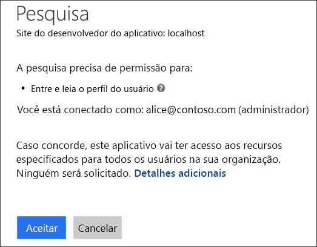
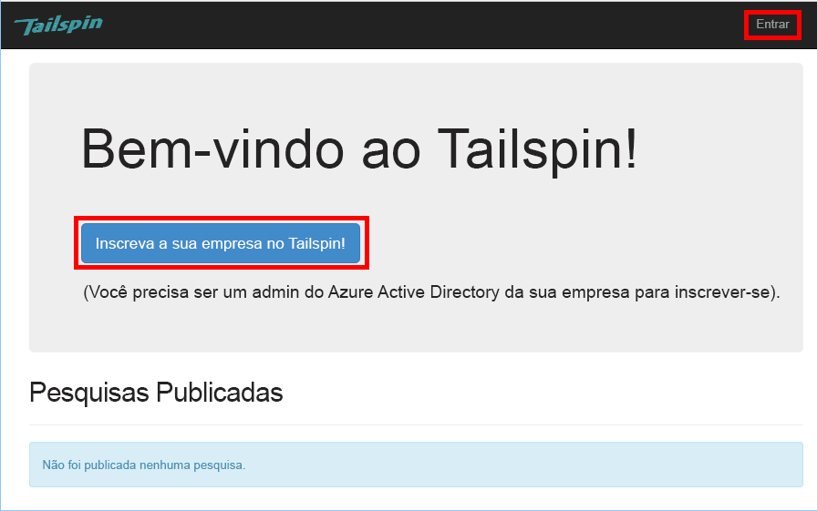

# <a name="tenant-sign-up-and-onboarding"></a>Inscrição e integração de locatário

[Código de exemplo do ][sample application]

Este artigo descreve como implementar um processo de *inscrição* em um aplicativo multilocatário que permite que um cliente inscreva sua organização para seu aplicativo.
Há várias razões para implementar um processo de inscrição:

* Permitir que um administrador do AD autorize o uso do aplicativo por toda a organização do cliente.
* Cobrar o pagamento por cartão de crédito ou coletar outras informações do cliente.
* Executar a instalação avulsa por locatário que venha a ser necessária para seu aplicativo.

## <a name="admin-consent-and-azure-ad-permissions"></a>Consentimento do administrador e permissões do Azure AD

Para autenticar com o Azure AD, o aplicativo precisa acessar o diretório do usuário. O aplicativo precisa, no mínimo, de permissão para ler o perfil do usuário. Na primeira vez que um usuário fizer logon, o Azure AD mostrará uma página de consentimento que lista as permissões que estão sendo solicitadas. Ao clicar em **Aceitar**, o usuário concederá permissão para o aplicativo.

Por padrão, o consentimento é concedido baseado em cada usuário. Todos os usuários que entrarem verão a página de consentimento. No entanto, o Azure AD também dá suporte ao *consentimento do administrador*, que permite a um administrador do AD dar consentimentos em nome de toda a organização.

Quando o fluxo de consentimento do administrador é usado, a página de autorização informa que o administrador do AD está concedendo a permissão em nome do locatário inteiro:



Depois que o administrador clica em **Aceitar**, outros usuários no mesmo locatário podem entrar e o Azure AD ignorará a tela de consentimento.

Somente um administrador do AD pode dar consentimento de administrador, já que ele concede permissão em nome de toda a organização. Se alguém que não for um administrador tentar autenticar com o fluxo de consentimento do administrador, o Azure AD exibirá um erro:


Se o aplicativo exigir permissões adicionais em um momento posterior, o cliente precisará se inscrever novamente e concordar com as permissões atualizadas.

## <a name="implementing-tenant-sign-up"></a>Implementando a inscrição de locatário

Para o aplicativo [Tailspin Surveys][Tailspin], definimos diversos requisitos para o processo de inscrição:

* Um locatário deve se inscrever antes dos usuários poderem entrar.
* A inscrição usa o fluxo de consentimento do administrador.
* A inscrição adiciona o locatário do usuário ao banco de dados do aplicativo.
* Depois que um locatário se inscreve, o aplicativo mostra uma página de integração.

Nesta seção, vamos examinar nossa implementação do processo de inscrição.
É importante entender que "inscrição" versus "logon" é um conceito de aplicativo. Durante o fluxo de autenticação, o Azure AD não tem como saber se o usuário está no processo de inscrição. Cabe ao aplicativo controlar o contexto.

Quando um usuário anônimo visita o aplicativo Surveys, o usuário vê dois botões, um para entrar e um para "registrar sua empresa" (inscrever-se).



Esses botões invocam ações na classe `AccountController`.

A ação `SignIn` retorna um **ChallegeResult**, que faz com que o middleware OpenID Connect redirecione para o ponto de extremidade de autenticação. Essa é a maneira padrão de disparar a autenticação no ASP.NET Core.

```csharp
[AllowAnonymous]
public IActionResult SignIn()
{
    return new ChallengeResult(
        OpenIdConnectDefaults.AuthenticationScheme,
        new AuthenticationProperties
        {
            IsPersistent = true,
            RedirectUri = Url.Action("SignInCallback", "Account")
        });
}
```

Agora compare a ação `SignUp` :

```csharp
[AllowAnonymous]
public IActionResult SignUp()
{
    var state = new Dictionary<string, string> { { "signup", "true" }};
    return new ChallengeResult(
        OpenIdConnectDefaults.AuthenticationScheme,
        new AuthenticationProperties(state)
        {
            RedirectUri = Url.Action(nameof(SignUpCallback), "Account")
        });
}
```

Como `SignIn`, a ação `SignUp` também retorna um `ChallengeResult`. Mas, dessa vez, vamos adicionar uma parte das informações de estado às `AuthenticationProperties` in the `ChallengeResult`:

* inscrever-se: um sinalizador booliano indicando que o usuário iniciou o processo de inscrição.

As informações de estado em `AuthenticationProperties` são adicionadas ao parâmetro [state] do OpenID Connect, que vai e volta durante o fluxo de autenticação.


Depois que o usuário é autenticado no Azure AD e é redirecionado ao aplicativo, o tíquete de autenticação contém o estado. Estamos usando isso para fazer com que o valor "inscrição" persista durante todo o fluxo de autenticação.

## <a name="adding-the-admin-consent-prompt"></a>Adicionando a solicitação de consentimento do administrador

No Azure AD, o fluxo de consentimento do administrador é disparado com a adição de um parâmetro "prompt" à cadeia de caracteres de consulta na solicitação de autenticação:

<!-- markdownlint-disable MD040 -->

```
/authorize?prompt=admin_consent&...
```

<!-- markdownlint-enable MD040 -->

O aplicativo Surveys adiciona o prompt durante o evento `RedirectToAuthenticationEndpoint` . Esse evento é chamado momentos antes do middleware redirecionar para o ponto de extremidade de autenticação.

```csharp
public override Task RedirectToAuthenticationEndpoint(RedirectContext context)
{
    if (context.IsSigningUp())
    {
        context.ProtocolMessage.Prompt = "admin_consent";
    }

    _logger.RedirectToIdentityProvider();
    return Task.FromResult(0);
}
```

A definição de `ProtocolMessage.Prompt` ordena ao middleware que adicione o parâmetro "prompt" à solicitação de autenticação.

Observe que o prompt é necessário somente durante a inscrição. O logon normal não deve incluí-lo. Para distinguir entre eles, verificamos o valor `signup` no estado de autenticação. O seguinte método de extensão verifica essa condição:

```csharp
internal static bool IsSigningUp(this BaseControlContext context)
{
    Guard.ArgumentNotNull(context, nameof(context));

    string signupValue;
    // Check the HTTP context and convert to string
    if ((context.Ticket == null) ||
        (!context.Ticket.Properties.Items.TryGetValue("signup", out signupValue)))
    {
        return false;
    }

    // We have found the value, so see if it's valid
    bool isSigningUp;
    if (!bool.TryParse(signupValue, out isSigningUp))
    {
        // The value for signup is not a valid boolean, throw

        throw new InvalidOperationException($"'{signupValue}' is an invalid boolean value");
    }

    return isSigningUp;
}
```

## <a name="registering-a-tenant"></a>Registrando um locatário

O aplicativo Surveys armazena algumas informações sobre cada locatário e usuário no banco de dados do aplicativo.


Na tabela Locatário, IssuerValue é o valor da declaração do emissor do locatário. Para o Azure AD, ele é o `https://sts.windows.net/<tentantID>` e fornece um valor exclusivo por locatário.

Quando um novo locatário se inscreve, o aplicativo Surveys grava um registro de locatário no banco de dados. Isso acontece dentro do evento `AuthenticationValidated`. Não faça isso antes desse evento, pois o token de ID não será validado ainda, portanto, você não pode confiar nos valores de declaração. Consulte [Autenticação].

Veja o código relevante do aplicativo Surveys:

```csharp
public override async Task TokenValidated(TokenValidatedContext context)
{
    var principal = context.AuthenticationTicket.Principal;
    var userId = principal.GetObjectIdentifierValue();
    var tenantManager = context.HttpContext.RequestServices.GetService<TenantManager>();
    var userManager = context.HttpContext.RequestServices.GetService<UserManager>();
    var issuerValue = principal.GetIssuerValue();
    _logger.AuthenticationValidated(userId, issuerValue);

    // Normalize the claims first.
    NormalizeClaims(principal);
    var tenant = await tenantManager.FindByIssuerValueAsync(issuerValue)
        .ConfigureAwait(false);

    if (context.IsSigningUp())
    {
        if (tenant == null)
        {
            tenant = await SignUpTenantAsync(context, tenantManager)
                .ConfigureAwait(false);
        }

        // In this case, we need to go ahead and set up the user signing us up.
        await CreateOrUpdateUserAsync(context.Ticket, userManager, tenant)
            .ConfigureAwait(false);
    }
    else
    {
        if (tenant == null)
        {
            _logger.UnregisteredUserSignInAttempted(userId, issuerValue);
            throw new SecurityTokenValidationException($"Tenant {issuerValue} is not registered");
        }

        await CreateOrUpdateUserAsync(context.Ticket, userManager, tenant)
            .ConfigureAwait(false);
    }
}
```

O código faz o seguinte:

1. Verifique se o valor do emissor do locatário já está no banco de dados. Se o locatário não se inscreveu, `FindByIssuerValueAsync` retorna null.
2. Se o usuário estiver se inscrevendo:
   1. Adicione o locatário ao banco de dados (`SignUpTenantAsync`).
   2. Adicione o usuário autenticado ao banco de dados (`CreateOrUpdateUserAsync`).
3. Caso contrário, siga o fluxo de entrada normal:
   1. Se o emissor do locatário não foi encontrado no banco de dados, isso significa que o locatário não está registrado e o cliente precisa se inscrever. Nesse caso, lance uma exceção para causar uma falha na autenticação.
   2. Caso contrário, crie um registro de banco de dados para o usuário, se já não houver um (`CreateOrUpdateUserAsync`).

Aqui está o método `SignUpTenantAsync` que adiciona o locatário ao banco de dados.

```csharp
private async Task<Tenant> SignUpTenantAsync(BaseControlContext context, TenantManager tenantManager)
{
    Guard.ArgumentNotNull(context, nameof(context));
    Guard.ArgumentNotNull(tenantManager, nameof(tenantManager));

    var principal = context.Ticket.Principal;
    var issuerValue = principal.GetIssuerValue();
    var tenant = new Tenant
    {
        IssuerValue = issuerValue,
        Created = DateTimeOffset.UtcNow
    };

    try
    {
        await tenantManager.CreateAsync(tenant)
            .ConfigureAwait(false);
    }
    catch(Exception ex)
    {
        _logger.SignUpTenantFailed(principal.GetObjectIdentifierValue(), issuerValue, ex);
        throw;
    }

    return tenant;
}
```

Veja um resumo de todo o fluxo de inscrição no aplicativo Surveys:

1. O usuário clica no botão **Inscrever-se** .
2. A ação `AccountController.SignUp` retorna um resultado de desafio.  O estado da autenticação inclui o valor "inscrição".
3. No evento `RedirectToAuthenticationEndpoint`, adicione o prompt `admin_consent`.
4. O middleware OpenID Connect redireciona para o Azure AD e o usuário é autenticado.
5. No evento `AuthenticationValidated` , procure o estado "inscrição".
6. Adicione o locatário ao banco de dados.

[**Avançar**][app roles]

<!-- links -->

[app roles]: app-roles.md
[Tailspin]: tailspin.md

[state]: https://openid.net/specs/openid-connect-core-1_0.html#AuthRequest
[Autenticação]: authenticate.md
[sample application]: https://github.com/mspnp/multitenant-saas-guidance
