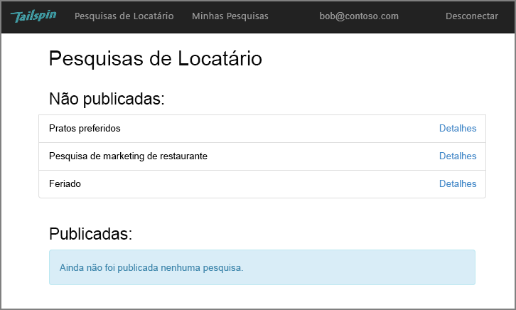
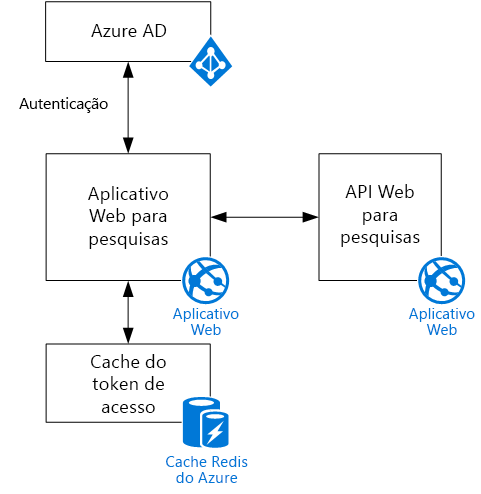

# O cenário da Tailspin

[Código de exemplo do ][sample application]

A Tailspin é uma empresa fictícia que está desenvolvendo um aplicativo SaaS chamado Surveys. Esse aplicativo permite às organizações criar e publicar pesquisas online.

* Uma organização pode se inscrever para obter o aplicativo.
* Depois que a organização estiver inscrita, os usuários podem entrar no aplicativo com suas credenciais organizacionais.
* Os usuários podem criar, editar e publicar pesquisas.

> [!NOTE]
> Para começar a usar o aplicativo, confira [Executar o aplicativo Surveys].
> 
> 

## Os usuários podem criar, editar e publicar pesquisas
Um usuário autenticado pode exibir todas as pesquisas que criou, ou com as quais tem direitos de colaborador, e criar novas pesquisas. Observe que o usuário é conectado com sua identidade organizacional, `bob@contoso.com`.

Esta captura de tela mostra a página Editar Pesquisa:

Os usuários também podem exibir as pesquisas criadas por outros usuários no mesmo locatário.

## Os proprietários das pesquisas podem convidar colaboradores
Quando um usuário cria uma pesquisa, ele ou ela pode convidar outras pessoas para ser colaboradores da pesquisa. Os colaboradores podem editar a pesquisa, mas não podem excluí-la ou publicá-la.  

Um usuário pode adicionar colaboradores de outros locatários, o que permite o compartilhamento de recursos entre locatários. Nesta captura de tela, Bob (`bob@contoso.com`) está adicionando Alice (`alice@fabrikam.com`) como colaboradora para uma pesquisa criada por ele.

Quando Beatriz fizer logon, ela verá a pesquisa listada em “Pesquisas com as quais posso contribuir”.

Observe que Beatriz entra em seu próprio locatário, não como uma convidada do locatário da Contoso. Alice tem permissões de colaboradora apenas para essa pesquisa &mdash; ela não pode exibir outros pesquisas do locatário Contoso.

## Arquitetura
O aplicativo Surveys consiste em um front-end da Web e um back-end de API da Web. Ambos são implementados usando o [ASP.NET Core].

O aplicativo Web usa o Azure AD (Azure Active Directory) para autenticar usuários. Ele também chama o Azure AD para obter tokens de acesso do OAuth 2 para a API Web. Tokens de acesso são armazenados no Cache Redis do Azure. O cache permite que várias instâncias compartilhem o mesmo cache de token (por exemplo, em um farm de servidores).

[**Avançar**][authentication]

<!-- Links -->

[authentication]: authenticate.md

[Executar o aplicativo Surveys]: ./run-the-app.md
[ASP.NET Core]: /aspnet/core
[sample application]: https://github.com/mspnp/multitenant-saas-guidance
