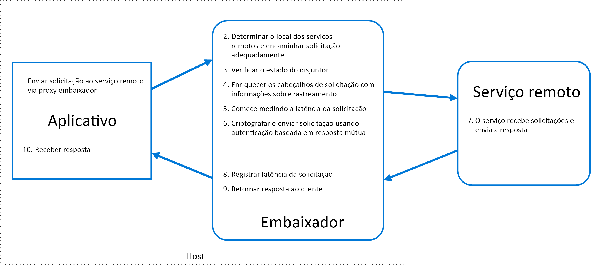

# Padrão embaixador

Crie serviços auxiliares que enviam solicitações de rede em nome de um consumidor de serviço ou aplicativo. Um serviço Embaixador pode ser pensado como um proxy de fora do processo colocalizado com o cliente.

Esse padrão pode ser útil para descarregar tarefas comuns de conectividade do cliente, como monitoramento, registro em log, roteamento, segurança (como TLS) e [padrões de resiliência][resiliency-patterns] de maneira independente de linguagem. Ele geralmente é usado com aplicativos herdados ou outros aplicativos difíceis de modificar, para ampliar seus recursos de rede. Também pode habilitar uma equipe especializada para implementar esses recursos.

## Contexto e problema

Aplicativos baseados em nuvem resilientes exigem recursos como [interrupção de circuito](./circuit-breaker.md), roteamento, medição e monitoramento, além da capacidade de fazer atualizações de configuração relacionadas à rede. Pode ser difícil ou impossível atualizar aplicativos herdados ou bibliotecas de código existente para adicionar esses recursos, pois o código não será mais mantido ou não poderá ser facilmente modificado pela equipe de desenvolvimento.

Chamadas de rede também podem exigir configuração significativa para conexão, autenticação e autorização. Se essas chamadas forem usadas em vários aplicativos, criados usando vários idiomas e estruturas, as chamadas deverão ser configuradas para cada uma dessas instâncias. Além disso, funcionalidade de segurança de rede poderá precisar ser gerenciada por uma equipe central na sua organização. Com uma base de código grande, pode ser arriscado para essa equipe atualizar código de aplicativo com a qual não esteja familiarizada.

## Solução

Coloque estruturas e bibliotecas de cliente em um processo externo que atue como proxy entre seus aplicativos e serviços externos. Implante o proxy no mesmo ambiente de host que seu aplicativo para permitir o controle sobre roteamento, resiliência e recursos de segurança, além de evitar quaisquer restrições de acesso relacionadas ao host. Você também pode usar o padrão de embaixador para padronizar e estender a instrumentação. O proxy pode monitorar métricas de desempenho, como latência ou uso de recursos, e esse monitoramento acontece no mesmo ambiente de host que o aplicativo.

Os recursos que são descarregados para o embaixador podem ser gerenciados de maneira independente do aplicativo. Você pode atualizar e modificar o embaixador sem afetar a funcionalidade herdada do aplicativo. Ele também permite equipes especializadas separadas implementar e manter os recursos de segurança, rede ou autenticação movidos para o embaixador.

Os serviços do embaixador podem ser implantados como um [sidecar](./sidecar.md) para acompanhar o ciclo de vida de um aplicativo ou serviço de consumidor. Como alternativa, se um embaixador for compartilhado por vários processos separados em um host em comum, ele poderá ser implantado como um daemon ou o serviço Windows. Se o serviço consumidor estiver em contêineres, o embaixador deverá ser criado como um contêiner separado no mesmo host, com os links apropriados configurados para comunicação.

## Problemas e considerações

- O proxy adiciona alguma sobrecarga de latência. Considere se uma biblioteca cliente, invocada diretamente pelo aplicativo, é uma abordagem melhor.
- Considere o possível impacto de incluir recursos generalizados no proxy. Por exemplo, o embaixador pode lidar com novas tentativas, mas isso pode não ser seguro, a menos que todas as operações sejam idempotentes.
- Considere um mecanismo para permitir que o cliente passe algum contexto para o proxy, bem como de volta ao cliente. Por exemplo, inclua cabeçalhos de solicitação HTTP para recusar a nova tentativa ou especificar o número máximo de tentativas.
- Considere como você vai empacotar e implantar o proxy.
- Considere se vai usar uma única instância compartilhada para todos os clientes ou uma instância para cada cliente.

## Quando usar esse padrão

Use este padrão quando:

- For necessário criar um conjunto comum de recursos de conectividade do cliente para vários idiomas ou estruturas.
- For necessário descarregar preocupações de conectividade de cliente cross-cutting para os desenvolvedores de infraestrutura ou outras equipes mais especializadas.
- For necessário dar suporte a requisitos de conectividade em nuvem ou cluster em um aplicativo herdado ou em um aplicativo difícil de modificar.

Esse padrão pode não ser adequado:

- Quando a latência de solicitação de rede for crítica. Um proxy introduzirá alguma sobrecarga, embora mínima e, em alguns casos, isso poderá afetar o aplicativo.
- Quando os recursos de conectividade de cliente forem consumidos por uma única linguagem. Nesse caso, a melhor opção pode ser uma biblioteca cliente distribuída para as equipes de desenvolvimento como um pacote.
- Quando os recursos de conectividade não podem ser generalizados e exigem uma integração mais profunda com o aplicativo cliente.

## Exemplo

O diagrama a seguir mostra um aplicativo fazendo uma solicitação para um serviço remoto por meio de um proxy embaixador. O embaixador possibilita roteamento, interrupção de circuito e registro em log. Ele chama o serviço remoto e, em seguida, retorna a resposta ao aplicativo cliente:

## Diretrizes relacionadas

- [Padrão sidecar](./sidecar.md)

<!-- links -->

[resiliency-patterns]: ./category/resiliency.md
