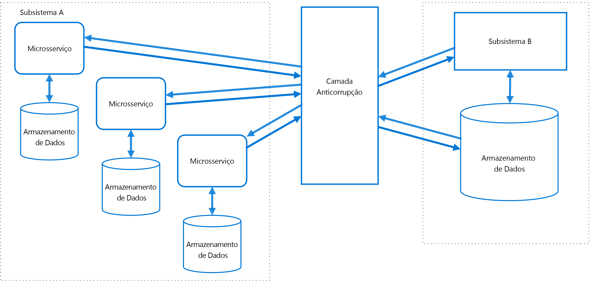

# Padrão de Camada Anticorrupção

Implemente uma camada de fachada ou de adaptador entre um aplicativo moderno e um sistema herdado do qual ele depende. Essa camada converte solicitações entre o aplicativo moderno e o sistema herdado. Use esse padrão para garantir que o design do aplicativo não seja limitado por dependências em sistemas herdados. Esse padrão foi descrito pela primeira vez por Eric Evans em *Design orientado ao domínio*.

## Contexto e problema

A maioria dos aplicativos depende de outros sistemas para alguns dados ou funcionalidade. Por exemplo, quando um aplicativo herdado é migrado para um sistema moderno, talvez ainda precise de recursos herdados existentes. Os novos recursos devem ser capazes de chamar o sistema herdado. Isso é especialmente verdadeiro para migrações graduais, onde os diferentes recursos de um aplicativo maior são movidos para um sistema moderno ao longo do tempo.

Geralmente, esses sistemas herdados sofrem problemas de qualidade, como esquemas de dados diferentes ou APIs obsoletas. Os recursos e tecnologias usados em sistemas herdados podem variar amplamente em sistemas mais modernos. Para interagir com o sistema herdado, pode ser necessário que o novo aplicativo dê suporte a infraestrutura, protocolos, modelos de dados, APIs ou outros recursos desatualizados que você não colocaria em um aplicativo moderno.

Manter o acesso entre sistemas herdados e novos pode forçar o novo sistema a aderir a pelo menos algumas das APIs do sistema herdado ou outras semânticas. Quando esses recursos herdados tiverem problemas de qualidade, o suporte a eles "corrompe" o que, caso contrário, seria um aplicativo moderno projetado corretamente. 

## Solução

Isole os sistemas herdados e modernos, colocando uma camada anticorrupção entre eles. Essa camada converte as comunicações entre os dois sistemas, permitindo que o sistema herdado permaneça inalterada, enquanto o aplicativo moderno pode evitar o comprometimento de seu design e abordagem tecnológica.

 

A comunicação entre o aplicativo moderno e a camada anticorrupção sempre usa o modelo de dados e a arquitetura do aplicativo. As chamadas da camada anticorrupção ao sistema herdado estão em conformidade com o modelo de dados ou métodos do sistema. A camada anticorrupção contém toda a lógica necessária para traduzir entre os dois sistemas. A camada pode ser implementada como um componente do aplicativo ou como um serviço independente.

## Problemas e considerações

- A camada anticorrupção pode adicionar latência para chamadas feitas entre os dois sistemas.
- A camada anticorrupção adiciona outro serviço que deve ser gerenciado e mantido.
- Considere como a camada anticorrupção será dimensionada.
- Considere se você precisa de mais de uma camada anticorrupção. Talvez você queira decompor a funcionalidade em vários serviços usando tecnologias ou linguagens diferentes, ou pode haver outros motivos para particionar a camada anticorrupção.
- Considere como a camada anticorrupção será gerenciada em relação com outros aplicativos ou serviços. Como ele será integrado aos processos de monitoramento, versão e configuração?
- Certifique-se de que a transação e a consistência de dados sejam mantidas e que possam ser monitoradas.
- Considere se a camada anticorrupção precisará lidar com toda a comunicação entre sistemas herdados e modernos, ou apenas com um subconjunto de recursos. 
- Considere se a camada anticorrupção deve ser permanente ou eventualmente preterida, uma vez toda a funcionalidade herdada tiver sido migrada.

## Quando usar esse padrão

Use esse padrão quando:

- Haja um plano de migração que acontecerá em vários estágios, mas a integração entre os sistemas novo e herdado precisará ser mantida.
- O sistema novo e o herdado têm uma semântica, mas ainda precisam se comunicar.

Esse padrão poderá não ser adequado se não houver nenhuma diferença significativa semântica entre os sistemas herdados e novos. 

## Diretrizes relacionadas

- [Padrão do Estrangulador][strangler]

[strangler]: ./strangler.md
