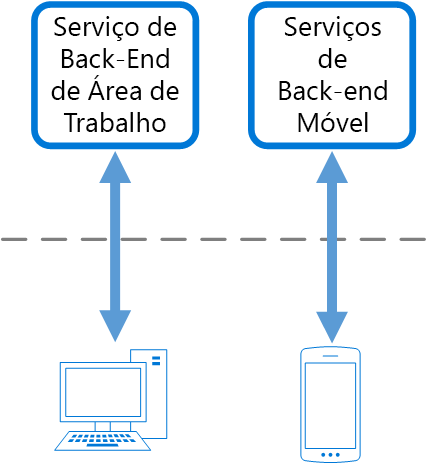

# Padrão de back-ends para front-ends

Crie serviços de back-end separados a serem consumidos por aplicativos de front-end específico ou interfaces. Esse padrão é útil quando você deseja evitar a personalização de um único back-end para várias interfaces.

## Contexto e problema

Inicialmente, um aplicativo pode ser direcionado a uma interface do usuário da Web da área de trabalho. Normalmente, um serviço de back-end é desenvolvido paralelamente, o que fornece os recursos necessários para essa interface do usuário. À medida que a base de usuários do aplicativo aumenta, é desenvolvido um aplicativo móvel que deve interagir com o mesmo back-end. O serviço de back-end se torna um back-end para fins gerais, atendendo aos requisitos de ambas as interfaces móvel e de área de trabalho.

Mas os recursos de um dispositivo móvel são muito diferentes de um navegador de área de trabalho em relação ao tamanho da tela, desempenho e limitações da tela. Como resultado, os requisitos para um back-end aplicativo móvel diferem da interface do usuário da Web da área de trabalho. 

Essas diferenças resultam em requisitos concorrentes do back-end. O back-end requer alterações regulares e significativas para atender à interface do usuário da área de trabalho da Web de e ao aplicativo móvel. Muitas vezes, equipes de interface separadas trabalham em cada front-end, fazendo com que o back-end vire um gargalo no processo de desenvolvimento. Requisitos conflitantes de atualização e a necessidade de manter o serviço funcionando para ambos os front-ends podem fazer com que se ponha muito esforço em um único recurso implantável.

 

Como a atividade de desenvolvimento se concentra no serviço de back-end, uma equipe separada pode ser criada para gerenciar e manter o back-end. Por fim, isso resulta em uma desconexão entre as equipes de desenvolvimento de interface e de back-end, sobrecarregando a equipe de back-end para equilibrar os requisitos concorrentes das diferentes equipes da interface do usuário. Quando uma equipe da interface precisa de alterações no back-end, essas alterações devem ser validadas com outras equipes da interface antes de serem integradas no back-end. 

## Solução

Crie um back-end por interface do usuário. Ajuste o comportamento e o desempenho de cada back-end para atender da melhor maneira possível às necessidades do ambiente de front-end, sem se preocupar em afetar outras experiências de front-end.

 

Como cada back-end é específico para uma interface, ele pode ser otimizado para essa interface. Como resultado, ele será menor, menos complexo e provavelmente mais rápido do que um back-end genérico que tenta satisfazer os requisitos de todas as interfaces. Cada equipe da interface tem autonomia para controlar seu próprio back-end e não depende de uma equipe centralizada de desenvolvimento de back-end. Isso dá flexibilidade à equipe da interface quanto à seleção da linguagem, cadência da versão, priorização de carga de trabalho e integração de recursos no back-end.

## Problemas e considerações

- Leve em consideração quantos back-ends serão implantados.
- Se interfaces diferentes (como clientes móveis) vão fazer as mesmas solicitações, veja se é necessário implementar um back-end para cada interface ou se um back-end único será suficiente.
- A duplicação de códigos entre serviços é altamente provável quando esse padrão é implementado.
- Serviços de back-end voltados ao front-end devem conter apenas o comportamento e a lógica específicos do cliente. A lógica de negócios gerais e outros recursos globais devem ser gerenciados em outro local do seu aplicativo.
- Pense em como esse padrão pode se refletir nas responsabilidades de uma equipe de desenvolvimento.
- Leve em consideração o tempo que levará para implementar esse padrão. O esforço para compilar os novos back-ends implicará em dívida técnica enquanto você continua a oferecer suporte ao back-end genérico existente?

## Quando usar esse padrão

Use esse padrão quando:

- Um serviço de back-end compartilhado ou de uso geral deve ser mantido com significativa sobrecarga de desenvolvimento.
- Você deseja otimizar o back-end para os requisitos de interfaces de cliente específicas.
- As personalizações são feitas para um back-end de fins gerais para acomodar várias interfaces.
- Uma linguagem alternativa é mais adequada para o back-end de uma interface do usuário diferente.

Esse padrão pode não ser adequado:

- Quando interfaces fazem solicitações iguais ou semelhantes para o back-end.
- Quando apenas uma interface é usada para interagir com o back-end.

## Diretrizes relacionadas

- [Padrão de agregação de gateway](./gateway-aggregation.md)
- [Padrão de descarregamento de gateway](./gateway-offloading.md)
- [Padrão de roteamento de gateway](./gateway-routing.md)

