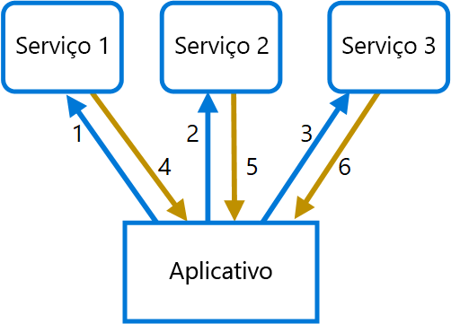
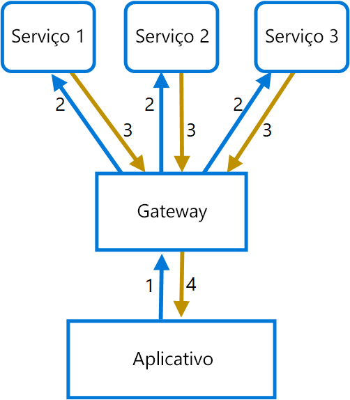

# <a name="gateway-aggregation-pattern"></a>Padrão de agregação de gateway

Use um gateway para agregar várias solicitações individuais em uma única solicitação. Esse padrão é útil quando um cliente deve fazer várias chamadas para diferentes sistemas de back-end ao executar uma operação.

## <a name="context-and-problem"></a>Contexto e problema

Para executar uma única tarefa, um cliente talvez precise fazer várias chamadas a vários serviços de back-end. Um aplicativo que depende de muitos serviços para executar uma tarefa deve gastar recursos em cada solicitação. Quando qualquer novo serviço ou recurso é adicionado ao aplicativo, solicitações adicionais são necessárias, além de aumentar os requisitos de recursos e chamadas de rede. Esse excesso de conversa entre um cliente e um back-end pode afetar negativamente o desempenho e a escala do aplicativo.  Arquiteturas de microsserviço tornaram esse problema mais comum, uma vez que aplicativos baseados em torno de muitos serviços menores naturalmente têm uma quantidade maior de chamadas entre serviços. 

No diagrama a seguir, o cliente envia solicitações a cada serviço (1,2,3). Cada serviço processa a solicitação e envia a resposta de volta ao aplicativo (4,5,6). Em uma rede celular com latência normalmente alta, usar solicitações individuais dessa maneira é ineficiente e pode resultar em interrupção da conectividade ou em solicitações incompletas. Embora cada solicitação possa ser executada em paralelo, o aplicativo deve enviar, aguardar e processar dados para cada solicitação, tudo em conexões separadas, aumentando a possibilidade de falha.

 

## <a name="solution"></a>Solução

Use um gateway para reduzir a conversa entre o cliente e os serviços. O gateway recebe solicitações de cliente, envia solicitações para os vários sistemas de back-end e, em seguida, agrega os resultados e envia-os de volta ao cliente solicitante.

Esse padrão pode reduzir o número de solicitações que o aplicativo faz a serviços back-end e melhorar o desempenho do aplicativo em redes de alta latência.

No diagrama a seguir, o aplicativo envia uma solicitação para o gateway (1). A solicitação contém um pacote de solicitações adicionais. O gateway as decompõe e processa cada solicitação enviando-a ao serviço em questão (2). Cada serviço retorna uma resposta ao gateway (3). O gateway combina as respostas de cada serviço e envia a resposta ao aplicativo (4). O aplicativo faz uma única solicitação e recebe apenas uma única resposta do gateway.



## <a name="issues-and-considerations"></a>Problemas e considerações

- O gateway não deve introduzir acoplamento de serviço entre os serviços de back-end.
- O gateway deve estar localizado próximo aos serviços de back-end para reduzir a latência tanto quanto possível.
- O serviço de gateway pode introduzir um ponto único de falha. Verifique se o gateway está corretamente projetado para atender aos requisitos de disponibilidade do aplicativo.
- O gateway pode introduzir um gargalo. O gateway deve ter um desempenho adequado para lidar com a carga e pode ser dimensionado para atender o seu crescimento previsto.
- Execute testes de carga no gateway para garantir que você não introduza falhas em cascata para serviços.
- Implemente um design resiliente usando técnicas como [bulkheads][bulkhead], [interrupção de circuito][circuit-breaker], [nova tentativa][retry] e tempos limite.
- Se uma ou mais chamadas de serviço levarem tempo demais, pode ser aceitável atingir o tempo limite e retornar um conjunto parcial de dados. Considere como o aplicativo tratará esse cenário.
- Use E/S assíncrona para garantir que um atraso no back-end não cause problemas de desempenho no aplicativo.
- Implemente rastreamento distribuído usando IDs de correlação para rastrear cada chamada individual.
- Monitore métricas de solicitação e tamanhos de resposta.
- Considere retornar dados em cache como uma estratégia de failover para lidar com falhas.
- Em vez de criar a agregação para o gateway, considere colocar um serviço de agregação atrás do gateway. Agregação de solicitação provavelmente terá requisitos de recursos diferentes de outros serviços no gateway e poderá afetar a funcionalidade de roteamento e descarregamento do gateway.

## <a name="when-to-use-this-pattern"></a>Quando usar esse padrão

Use esse padrão quando:

- Um cliente precisa se comunicar com vários serviços de back-end para executar uma operação.
- O cliente puder usar redes com latência significativa, como redes de celulares.

Esse padrão pode não ser adequado quando:

- Você quiser reduzir o número de chamadas entre um cliente e um único serviço entre várias operações. Nesse cenário, talvez seja melhor adicionar uma operação em lote ao serviço.
- O cliente ou aplicativo está localizado próximo dos serviços de back-end e a latência não é um fator significativo.

## <a name="example"></a>Exemplo

O exemplo a seguir ilustra como criar um serviço NGINX de agregação do gateway simples usando Lua.

```lua
worker_processes  4;

events {
  worker_connections 1024;
}

http {
  server {
    listen 80;

    location = /batch {
      content_by_lua '
        ngx.req.read_body()

        -- read json body content
        local cjson = require "cjson"
        local batch = cjson.decode(ngx.req.get_body_data())["batch"]

        -- create capture_multi table
        local requests = {}
        for i, item in ipairs(batch) do
          table.insert(requests, {item.relative_url, { method = ngx.HTTP_GET}})
        end

        -- execute batch requests in parallel
        local results = {}
        local resps = { ngx.location.capture_multi(requests) }
        for i, res in ipairs(resps) do
          table.insert(results, {status = res.status, body = cjson.decode(res.body), header = res.header})
        end

        ngx.say(cjson.encode({results = results}))
      ';
    }

    location = /service1 {
      default_type application/json;
      echo '{"attr1":"val1"}';
    }

    location = /service2 {
      default_type application/json;
      echo '{"attr2":"val2"}';
    }
  }
}
```

## <a name="related-guidance"></a>Diretrizes relacionadas

- [Padrão de back-ends para front-ends](./backends-for-frontends.md)
- [Padrão de descarregamento de gateway](./gateway-offloading.md)
- [Padrão de roteamento de gateway](./gateway-routing.md)

[bulkhead]: ./bulkhead.md
[circuit-breaker]: ./circuit-breaker.md
[retry]: ./retry.md