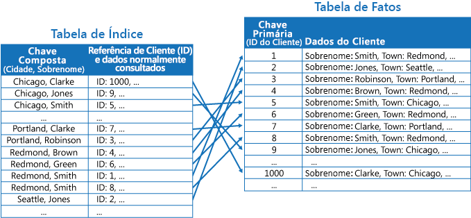
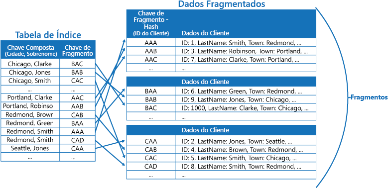

# Padrão de Tabela de Índice

[!INCLUDE [header](../_includes/header.md)]

Crie índices nos campos em armazenamentos de dados que são frequentemente referenciados por consultas. Esse padrão pode melhorar o desempenho de consulta, permitindo que os aplicativos localizem mais rapidamente os dados a serem recuperados de um armazenamento de dados.

## Contexto e problema

Muitos armazenamento de dados organizam os dados para uma coleção de entidades utilizando a chave primária. Um aplicativo pode utilizar essa chave para localizar e recuperar dados. A figura mostra um exemplo de um armazenamento de dados que contém informações do cliente. A chave primária é a ID do Cliente. A figura mostra a informação do cliente organizada pela chave primária (ID do cliente).

Embora a chave primária seja valiosa para consultas que busquem dados baseados no valor dessa chave, um aplicativo talvez não seja capaz de utilizar a chave primária, caso precise recuperar dados baseados em algum outro campo. No exemplo de clientes, um aplicativo não pode utilizar a chave primária da ID do cliente para recuperar clientes se consultar os dados unicamente ao referenciar o valor de algum outro atributo, como a cidade em que o cliente está localizado. Para realizar uma consulta como essa, o aplicativo pode ter que buscar e examinar todos os registros de clientes, o que pode ser um processo lento.

Muitos sistema de gerenciamento de banco de dados relacional fornecem suporte a índices secundários. Um índice secundário é uma estrutura de dados separada, organizada por um ou mais campos de chave não primários (secundários) e indica onde os dados de cada valor indexado são armazenados. Os itens em um índice secundário normalmente são classificados pelo valor das chaves secundárias para permitir uma pesquisa rápida de dados. Esses índices geralmente são mantidos automaticamente pelo sistema gerenciador de banco de dados.

É possível criar quantos índices secundários forem necessários para fornecer suporte às diferentes consultas que seu aplicativo executa. Por exemplo, em uma tabela de Clientes em um banco de dados relacional em que a ID do cliente é a chave primária, é útil adicionar um índice secundário sobre o campo da cidade, caso o aplicativo procure frequentemente os clientes pela cidade onde residem.

No entanto, embora os índices secundários sejam comuns em sistemas relacionais, a maioria dos armazenamentos de dados NoSQL utilizados por aplicativos de nuvem não fornecem uma característica equivalente.

## Solução

Se o armazenamento de dados não fornecer suporte a índices secundários, você poderá emulá-los manualmente criando suas próprias tabelas de índice. Uma tabela de índice organiza os dados por uma chave especificada. Três estratégias são comumente utilizadas para estruturar uma tabela de índice, dependendo do número de índices secundários necessários e da natureza das consultas que um aplicativo executa.

A primeira estratégia é duplicar os dados em cada tabela de índice, mas organizá-los por diferentes chaves (desnormalização completa). A próxima figura mostra tabelas de índice que organizam as mesmas informações do cliente por Cidade e Sobrenome.

Esta estratégia é apropriada se os dados forem relativamente estáticos em relação ao número de vezes que ele é consultado utilizando cada chave. Se os dados forem mais dinâmicos, a sobrecarga de processamento da manutenção de cada tabela de índice será muito grande para que essa abordagem seja útil. Além disso, se o volume de dados for muito grande, a quantidade de espaço necessário para armazenar os dados duplicados for significativa.

A segunda estratégia é criar tabelas de índice normalizadas organizadas por diferentes chaves e referenciar os dados originais utilizando a chave primária em vez de duplicá-la, conforme mostrado na figura a seguir. Os dados originais são chamados de tabela de fatos.

Essa técnica economiza espaço e reduz a sobrecarga da manutenção de dados duplicados. A desvantagem é que um aplicativo deve executar duas operações de pesquisa para localizar dados utilizando uma chave secundária. Ele deve localizar a chave primária para os dados na tabela de índice e, em seguida, usar a chave primária para pesquisar os dados na tabela de fatos.

A terceira estratégia é criar tabelas de índice parcialmente normalizadas organizadas por diferentes chaves que dupliquem campos frequentemente recuperados. Consulte a tabela de fatos para acessar campos com acesso menor. A próxima figura mostra como os dados com acesso comum são duplicados em cada tabela de índice.

Com essa estratégia, você pode estabelecer um equilíbrio entre as duas primeiras abordagens. Os dados para consultas comuns podem ser recuperados rapidamente, utilizando uma pesquisa única, enquanto o espaço e a sobrecarga de manutenção não são tão significativos quanto a duplicação de todo o conjunto de dados.

Se um aplicativo frequentemente consulta dados, especificando uma combinação de valores (por exemplo, "Localizar todos os clientes que vivem em Redmond e que tenham um sobrenome de Smith"), você poderá implementar as chaves dos itens na tabela de índice como uma concatenação do atributo Cidade e do atributo Sobrenome. A figura a seguir mostra uma tabela de índice baseada em chaves compostas. As chaves são classificadas por Cidade e, em seguida, por Sobrenome para registros que tenham o mesmo valor para Cidade.

As tabelas de índice podem acelerar as operações de consulta em relação aos dados fragmentados e são especialmente úteis quando a chave de fragmento for com hash. A próxima figura mostra um exemplo em que a chave de fragmento é um hash da ID do Cliente. A tabela de índice pode organizar dados pelo valor sem hash (Cidade e Sobrenome) e fornecer a chave de fragmento com hash como o dado de pesquisa. Isso pode salvar o aplicativo de cálculos repetidos de chaves de hash (uma operação cara) se precisar recuperar dados que caiam em um intervalo ou, precise buscar dados em ordem de chave sem hash. Por exemplo, uma consulta como "Localizar todos os clientes que vivem em Redmond" pode ser rapidamente resolvida, localizando os itens correspondentes na tabela de índice, onde são todos armazenados em um bloco contíguo. Em seguida, siga as referências para os dados do cliente, utilizando as chaves de fragmento armazenadas na tabela de índice.

## Problemas e considerações

Considere os seguintes pontos ao decidir como implementar esse padrão:

- A sobrecarga da manutenção de índices secundários pode ser significativa. Você deve analisar e entender as consultas que seu aplicativo utiliza. Apenas crie tabelas de índice quando elas provavelmente serão utilizadas regularmente. Não crie tabelas de índice especulativa para fornecer suporte a consultas que um aplicativo não executa ou que executa apenas ocasionalmente.
- Duplicar dados em uma tabela de índice pode adicionar sobrecarga significativa nos custos de armazenamento e no esforço necessário para manter várias cópias de dados.
- A implementação de uma tabela de índice como uma estrutura normalizada que faz referência aos dados originais requer um aplicativo para executar duas operações de pesquisa para localizar dados. A primeira operação pesquisa a tabela de índice para recuperar a chave primária e a segunda utiliza a chave primária para buscar os dados.
- Se um sistema incorporar uma série de tabelas de índice em conjuntos de dados muito grandes, poderá ser difícil manter a consistência entre as tabelas de índice e os dados originais. Pode ser possível projetar o aplicativo em torno do modelo de coerência eventual. Por exemplo, para inserir, atualizar ou excluir dados, um aplicativo pode enviar uma mensagem para uma fila e permitir que uma tarefa separada execute a operação e mantenha as tabelas de índice que fazem referência a esses dados de forma assíncrona. Para obter mais informações sobre como implementar a coerência eventual, consulte o [Primer de consistência de dados](https://msdn.microsoft.com/library/dn589800.aspx).

   >  As tabelas de armazenamento do Microsoft Azure fornecem suporte a atualizações transacionais para alterações feitas nos dados mantidos na mesma partição (referidas como transações de grupos da entidade). Se for possível armazenar os dados para uma tabela de fatos e uma ou mais tabelas de índice na mesma partição, você poderá utilizar esse recurso para garantir a consistência.

- As tabelas de índice podem ser particionadas ou fragmentadas.

## Quando usar esse padrão

Utilize esse padrão para melhorar o desempenho de consulta quando um aplicativo frequentemente precisar recuperar dados utilizando uma tecla diferente da chave primária (ou fragmento).

Esse padrão pode não ser útil quando:

- Os dados forem voláteis. Uma tabela de índice pode tornar-se desatualizada muito rapidamente, tornando-a ineficaz ou fazendo com que a sobrecarga de manutenção da tabela de índice seja maior do que qualquer economia feita durante a utilização.
- Um campo selecionado como a chave secundária para uma tabela de índice não é discriminatório e somente poderá ter um conjunto de valores pequeno (por exemplo, gênero).
- O equilíbrio dos valores de dados para um campo selecionado como a chave secundária para uma tabela de índice é altamente distorcido. Por exemplo, se 90% dos registros contiverem o mesmo valor em um campo, a criação e manutenção de uma tabela de índice para pesquisar dados com base nesse campo pode criar mais sobrecarga do que examinar sequencialmente através dos dados. No entanto, se as consultas com frequência atingirem valores que se situam nos restantes 10%, esse índice poderá ser útil. Você deve entender as consultas que seu aplicativo está executando e a frequência com que são executados.

## Exemplo

As tabelas de armazenamento do Azure fornecem um armazenamento de dados valor/chave altamente escalonável para aplicativos em execução na nuvem. Os aplicativos armazenam e recuperam valores de dados especificando uma chave. Os valores de dados podem conter vários campos, mas a estrutura de um item de dados é opaca para armazenamento de tabela, que simplesmente administra um item de dados como uma matriz de bytes.

As tabelas de armazenamento do Azure também fornecem suporte para fragmentação. A chave de fragmentação inclui dois elementos, uma chave de partição e uma chave de linha. Os itens que possuem a mesma chave de partição são armazenados na mesma partição (fragmento) e os itens são armazenados na ordem das linhas do item dentro de um fragmento. O armazenamento de tabelas é otimizado para realizar consultas que buscam dados que caem em um intervalo contíguo de valores de linha de linha dentro de uma partição. Se você estiver construindo aplicativos de nuvem que armazenam informações em tabelas do Azure, será necessário estruturar seus dados com esse recurso em mente.

Por exemplo, considere um aplicativo que armazena informações sobre filmes. O aplicativo frequentemente consulta filmes por gênero (ação, documentário, histórico, comédia, drama, etc.). Você poderia criar uma tabela do Azure com partições para cada gênero, utilizando o gênero como a chave de partição e especificando o nome do filme como a chave de linha, conforme mostrado na próxima figura.

Essa abordagem é menos efetiva se o aplicativo também precisar consultar filmes por ator principal. Nesse caso, é possível criar uma tabela do Azure separada que age como uma tabela de índice. A chave de partição é o ator e a chave de linha é o nome do filme. Os dados para cada ator serão armazenados em partições separadas. Se um filme estrelar mais de um ator, o mesmo filme ocorrerá em várias partições.

É possível duplicar os dados do filme nos valores mantidos por cada partição, adotando a primeira abordagem descrita na seção Solução acima. No entanto, é provável que cada filme seja replicado várias vezes (uma vez por cada ator), por isso, pode ser mais eficiente desnormalizar parcialmente os dados para fornecer suporte às consultas mais comuns (como os nomes dos outros atores) e habilitar um aplicativo para recuperar os detalhes restantes, incluindo a chave de partição necessária para localizar a informação completa nas partições de gênero. Essa abordagem é descrita pela terceira opção na seção Solução. A próxima figura mostra essa abordagem.

## Diretrizes e padrões relacionados

Os padrões e diretrizes a seguir também podem ser relevantes ao implementar esse padrão:

- [Primer de Consistência de Dados](https://msdn.microsoft.com/library/dn589800.aspx). Uma tabela de índice deve ser mantida à medida que os dados que indexa as alterações. Na nuvem, pode não ser possível ou apropriado executar operações que atualizem um índice como parte da mesma transação que altera os dados. Nesse caso, uma abordagem eventualmente coerente é mais apropriada. Fornece informações sobre as questões relacionadas com a coerência eventual.
- [Padrão de Fragmentação](https://msdn.microsoft.com/library/dn589797.aspx). O padrão da tabela de índice é frequentemente utilizado em conjunto com dados compartilhados usando fragmentos. O padrão de Fragmentação fornece mais informações sobre como dividir um armazenamento de dados em um conjunto de fragmentos.
- [Padrão de Exibição Materializada](materialized-view.md). Em vez de indexar dados para fornecer suporte às consultas que resumem dados, talvez seja mais apropriado criar uma exibição materializada dos dados. Descreve como fornecer suporte às consultas de resumo eficientes, gerando exibições pré-populadas sobre dados.
