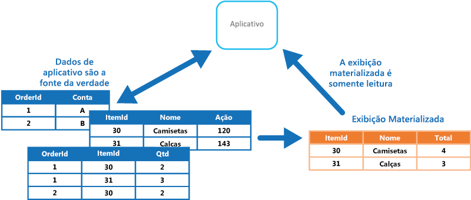
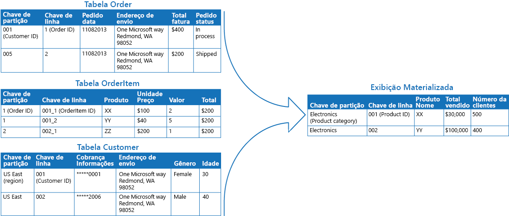

# Padrão de Exibição Materializada

[!INCLUDE [header](../_includes/header.md)]

Gere exibições pré-preenchidas nos dados em um ou mais armazenamentos de dados quando os dados não estiverem formatados como o ideal para as operações de consulta necessárias. Isso pode ajudar a dar suporte a consultas e extração de dados eficientes, além de melhorar o desempenho do aplicativo.

## Contexto e problema

Ao armazenar dados, a prioridade para desenvolvedores e administradores de dados geralmente recai sobre como os dados são armazenados, em vez de como eles são lidos. O formato de armazenamento escolhido geralmente está bastante relacionado ao formato dos dados, aos requisitos para gerenciar o tamanho e a integridade dos dados e ao tipo de armazenamento em uso. Por exemplo, ao usar o armazenamento de documentos NoSQL, muitas vezes os dados são representados como uma série de agregações, cada uma contendo todas as informações para tal entidade.

No entanto, isso pode ter um efeito negativo sobre consultas. Quando uma consulta precisa de apenas um subconjunto dos dados de algumas entidades, como um resumo de pedidos para vários clientes sem todos os detalhes do pedido, ela deve extrair todos os dados das entidades relevantes para obter as informações necessárias.

## Solução

Para dar suporte a consultas eficientes, uma solução comum é gerar, com antecedência, uma exibição que materialize os dados em um formato adequado para o conjunto de resultados necessários. O padrão de Exibição Materializada descreve como gerar exibições de dados pré-preenchidos em ambientes em que os dados de origem não estão em um formato adequado para a consulta, em que é difícil gerar uma consulta adequada ou em que o desempenho da consulta é ruim devido à natureza dos dados ou do armazenamento de dados.

Essas exibições materializadas, as quais contêm apenas os dados necessários para uma consulta, permitem que os aplicativos obtenham rapidamente as informações de que precisam. Além da junção de tabelas ou da combinação de entidades de dados, as exibições materializadas podem incluir os valores atuais das colunas calculadas ou dos itens de dados, os resultados da combinação de valores ou da execução de transformações nos itens de dados, além de valores especificados como parte da consulta. Uma exibição materializada ainda pode ser otimizada para apenas uma única consulta.

Um ponto-chave é que uma exibição materializada e os dados contidos nela são completamente descartáveis, porque podem ser inteiramente recriados a partir dos armazenamentos de dados de origem. Uma exibição materializada nunca é atualizada diretamente por um aplicativo e, por isso, é um cache especializado.

Quando os dados de origem da exibição forem alterados, a exibição deve ser atualizada para incluir as novas informações. Você pode agendar para que ela seja feita automaticamente ou quando o sistema detectar uma alteração nos dados originais. Em alguns casos, pode ser necessário regenerar a exibição manualmente. A figura mostra um exemplo de como o padrão de Exibição Materializada pode ser usado.

## Problemas e considerações

Considere os seguintes pontos ao decidir como implementar esse padrão:

Como e quando a exibição será atualizada. Idealmente, ela será regenerada em resposta a um evento indicando uma alteração nos dados de origem, embora isso possa levar a uma sobrecarga excessiva se os dados de origem forem alterados rapidamente. Como alternativa, considere o uso de uma tarefa agendada, um gatilho externo ou uma ação manual para regenerar a exibição.

Em alguns sistemas, como ao usar o padrão de Fornecimento do Evento para manter um armazenamento apenas dos eventos que modificaram os dados, as exibições materializadas são necessárias. Pré-preencher exibições por meio da examinação de todos os eventos para determinar o estado atual pode ser a única maneira de obter informações do armazenamento de eventos. Se não estiver usando o Fornecimento do Evento, você precisa levar em consideração se uma exibição materializada é útil ou não. Exibições materializadas tendem a ser personalizadas especificamente para apenas uma consulta ou uma pequena quantidade de consultas. Se forem usadas várias consultas, as exibições materializadas podem resultar em requisitos inaceitáveis de capacidade e custo de armazenamento.

Leve em consideração o impacto na consistência de dados ao gerar a exibição e ao atualizá-la se isso ocorrer como um agendamento. Se a fonte de dados estiver sendo alterada quando a exibição for gerada, a cópia dos dados na exibição não estará totalmente consistente com os dados originais.

Leve em consideração o local no qual você vai armazenar a exibição. A exibição não precisa estar localizada no mesmo armazenamento ou na mesma partição como os dados originais. Ela pode ser um subconjunto de algumas partições diferentes combinadas.

Uma exibição pode ser recriada caso seja perdida. Por causa disso, se a exibição for transitória e só seja usada para melhorar o desempenho de consulta ao refletir o estado atual dos dados ou para melhorar a escalabilidade, ela pode ser armazenada em um cache ou em um local menos confiável.

Ao definir uma exibição materializada, maximize seu valor adicionando itens de dados ou colunas a ela com base na computação ou transformação de itens de dados existentes, em valores passados na consulta ou em combinações desses valores, quando apropriado.

Considere indexar a exibição materializada, nos locais em que o mecanismo de armazenamento oferecer suporte para isso, para aumentar ainda mais o desempenho. A maioria dos bancos de dados relacionais dão suporte à indexação de exibições, assim como soluções de big data baseadas em Apache Hadoop.

## Quando usar esse padrão

Esse padrão é útil:
- Ao criar exibições materializadas sobre dados que sejam difíceis de serem consultados diretamente ou em locais em que as consultas devem ser muito complexas para se extraírem os dados armazenados em uma forma normalizada, estruturada ou não estruturada.
- Ao criar exibições temporárias que podem melhorar drasticamente o desempenho da consulta ou que podem atuar diretamente como exibições de dados ou objetos de transferência de dados para a interface do usuário, para a geração de relatórios ou para fins de exibição.
- Ao dar suporte a cenários ocasionalmente conectados ou desconectados nos quais a conexão ao armazenamento de dados não está sempre disponível. A exibição pode ser armazenada em cache local nesse caso.
- Ao simplificar consultas e expor dados para experimentação de uma forma que não requeira conhecimento do formato dos dados de origem. Por exemplo, unindo tabelas diferentes em um ou mais bancos de dados ou em um ou mais domínios em armazenamentos do NoSQL e depois formatando os dados para se ajustarem ao seu uso eventual.
- Ao fornecer acesso a subconjuntos específicos dos dados de origem que, por motivos de segurança ou privacidade, não devem ser amplamente acessíveis, abertos para modificação ou totalmente expostos a usuários.
- Ao criar ponte para diferentes armazenamentos de dados para aproveitar os recursos individuais. Por exemplo, usando um armazenamento de nuvem que seja eficiente para gravação como o armazenamento de dados de referência e um banco de dados relacional que ofereça bom desempenho de leitura e consulta para manter as exibições materializadas.

Esse padrão não é útil nas seguintes situações:
- Os dados de origem são simples e fáceis de serem consultados.
- Os dados de origem mudam muito rapidamente ou podem ser acessados sem usar uma exibição. Nesses casos, você deve evitar a sobrecarga de processamento da criação de exibições.
- A consistência é uma alta prioridade. As exibições podem não ser sempre totalmente consistentes com os dados originais.

## Exemplo

A figura a seguir mostra um exemplo de como usar o padrão de Exibição Materializada para gerar um resumo de vendas. Dados nas tabelas Order, OrderItem e Customer em partições separadas em uma conta de armazenamento do Azure são combinadas para gerar uma exibição contendo o valor total de vendas para cada produto na categoria Eletrônicos, juntamente com uma contagem do número de clientes que fizeram compras de cada item.

Criar essa exibição materializada requer consultas complexas. No entanto, ao expor o resultado da consulta como uma exibição materializada, os usuários podem facilmente obter os resultados e usá-los diretamente ou incorporá-los em outra consulta. É provável que a exibição seja usada em um sistema ou painel de geração de relatórios e pode ser atualizada de forma programada, por exemplo, semanalmente.

>  Embora esse exemplo utilize o armazenamento de tabelas do Azure, muitos sistemas de gerenciamento de banco de dados relacionais também fornecem suporte nativo para exibições materializadas.

## Diretrizes e padrões relacionados

Os padrões e diretrizes a seguir também podem ser relevantes ao implementar esse padrão:
- [Primer de consistência de dados](https://msdn.microsoft.com/library/dn589800.aspx). As informações de resumo em uma exibição materializada têm de ser mantidas para que reflita os valores de dados subjacentes. Como os valores de dados são alterados, pode não ser prático atualizar os dados de resumo em tempo real e, em vez disso, você terá de adotar uma abordagem consistente em algum momento. Resume os problemas em torno da manutenção de consistência de dados distribuídos e descreve os benefícios e as vantagens e desvantagens de modelos diferentes de consistência.
- [Padrão de comando e segregação de responsabilidade de consulta (CQRS)](cqrs.md). Use para atualizar as informações em uma exibição materializada respondendo a eventos que ocorrem quando os valores de dados subjacentes são alterados.
- [Padrão de Fornecimento do Evento](event-sourcing.md). Use em conjunto com o padrão de CQRS para manter as informações em uma exibição materializada. Quando os valores de dados sobre os quais uma exibição materializada se baseia são alterados, o sistema pode gerar eventos que descrevam essas alterações e salvem-nas em um armazenamento de eventos.
- [Padrão de Tabela de Índice](index-table.md). Os dados em uma exibição materializada normalmente são organizados por uma chave primária, mas talvez consultas precisem recuperar informações dessa exibição por meio da examinação de dados em outros campos. Use para criar índices secundários em conjuntos de dados de armazenamentos de dados que não têm suporte nativo a índices secundários.
