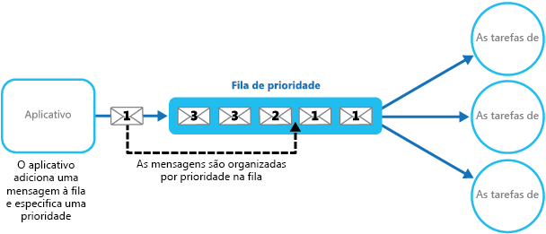
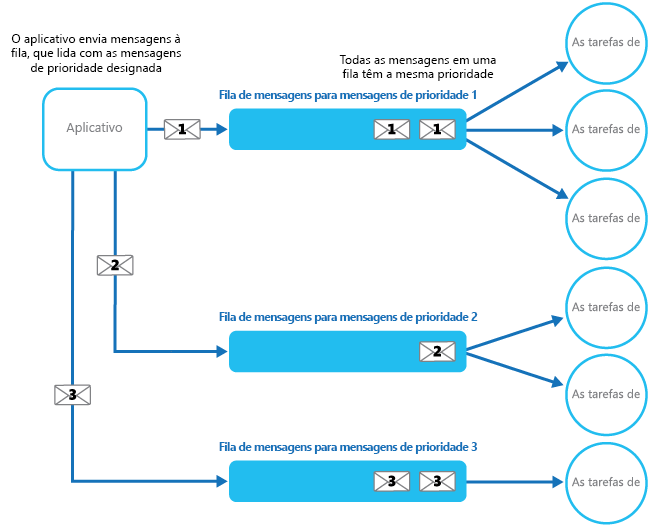
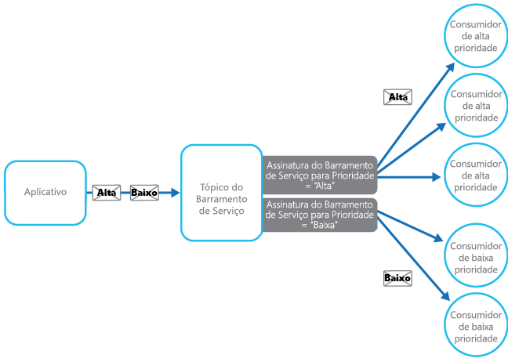

# <a name="priority-queue-pattern"></a>Padrão de fila de prioridade

[!INCLUDE [header](../_includes/header.md)]

Priorize as solicitações enviadas a serviços para que as solicitações com uma prioridade mais alta sejam recebidas e processadas mais rapidamente do que aquelas com uma prioridade mais baixa. Esse padrão é útil em aplicativos que oferecem garantias de nível de serviço diferentes para clientes individuais.

## <a name="context-and-problem"></a>Contexto e problema

Os aplicativos podem delegar tarefas específicas para outros serviços, por exemplo, para executar processamento em segundo plano ou para se integrar com outros aplicativos ou serviços. Na nuvem, uma fila de mensagens é normalmente usada para delegar as tarefas para processamento em segundo plano. Em muitos casos, as solicitações do pedido são recebidas por um serviço que não é importante. No entanto, em alguns casos, é necessário priorizar solicitações específicas. Essas solicitações devem ser processadas antes que as solicitações de prioridade mais baixa enviadas anteriormente pelo aplicativo.

## <a name="solution"></a>Solução

Uma fila é geralmente uma estrutura PEPS (primeiro a entrar, primeiro a sair), e os consumidores normalmente recebem mensagens na mesma ordem em que elas foram postadas na fila. No entanto, algumas filas de mensagens dão suporte a mensagens de prioridade. O aplicativo que posta uma mensagem pode atribuir uma prioridade, e as mensagens na fila são reordenadas automaticamente para que aquelas com prioridade mais alta sejam recebidas antes daquelas com prioridade mais baixa. A figura ilustra uma fila com a prioridade das mensagens.



> A maioria das implementações de fila de mensagens dá suporte a vários consumidores (seguindo o [padrão de Consumidores concorrentes](https://msdn.microsoft.com/library/dn568101.aspx)), e o número de processos do consumidor pode ser escalado verticalmente ou reduzido horizontalmente dependendo da demanda.

Em sistemas que não dão suporte a filas de mensagens baseadas em prioridade, uma solução alternativa é manter uma fila separada para cada prioridade. O aplicativo é responsável por postar mensagens na fila apropriada. Cada fila pode ter um pool separado de consumidores. Filas de prioridade mais alta podem ter um pool maior de consumidores em execução no hardware mais rápido que as filas de prioridade mais baixa. A figura a seguir ilustra o uso de filas de mensagens separadas para cada prioridade.




Uma variação dessa estratégia é ter um único pool de consumidores que verifica se há mensagens em filas de alta prioridade primeiro e só então começa a buscar mensagens das filas de prioridade mais baixa. Há algumas diferenças semânticas entre uma solução que usa um único pool de processos do consumidor (com uma única fila que dá suporte a mensagens com prioridades diferentes ou com várias filas que cada uma lida com mensagens de uma única prioridade) e uma solução que usa várias filas com um pool separado para cada fila.

Na abordagem de pool único, as mensagens de prioridade mais alta sempre são recebidas e processadas antes das mensagens de prioridade mais baixa. Em teoria, mensagens com uma prioridade muito baixa poderiam ser substituídas continuamente e, talvez, nunca seriam processadas. Na abordagem de vários pools, as mensagens de prioridade mais baixa serão sempre processadas; não tão rapidamente quanto aquelas de uma prioridade mais alta (dependendo do tamanho relativo dos pools e dos recursos que elas têm disponíveis).

Usar um mecanismo de enfileiramento de prioridade pode fornecer as seguintes vantagens:

- Ele permite que os aplicativos atendam aos requisitos de negócios que requerem a priorização de disponibilidade ou desempenho, como oferecer níveis diferentes de serviço para grupos de clientes específicos.

- Ele pode ajudar a minimizar os custos operacionais. Na abordagem de fila única, você pode reduzir o número de consumidores se necessário. Mensagens de alta prioridade ainda serão processadas primeiro (embora possivelmente de modo mais lento), e mensagens de prioridade mais baixa podem ser atrasadas por mais tempo. Se você já implementou a abordagem de fila de mensagens com vários pools separados de consumidores para cada fila, pode reduzir o pool de consumidores de filas de prioridade mais baixa ou mesmo suspender o processamento para algumas filas de prioridade muito baixa, interrompendo todos os consumidores que escutam mensagens nessas filas.

- A abordagem de várias filas de mensagens pode ajudar a maximizar o desempenho e a escalabilidade do aplicativo por meio do particionamento das mensagens com base nos requisitos de processamento. Por exemplo, tarefas vitais podem ser priorizadas para serem manipuladas pelo receptores que executam imediatamente enquanto tarefas em segundo plano menos importantes podem ser tratadas por receptores que são agendados para executar em períodos menos ocupados.

## <a name="issues-and-considerations"></a>Problemas e considerações

Considere os seguintes pontos ao decidir como implementar esse padrão:

Defina as prioridades no contexto da solução. Por exemplo, alta prioridade pode significar que as mensagens devem ser processadas dentro de dez segundos. Identifique os requisitos para lidar com itens de alta prioridade e os outros recursos que devem ser alocados para atender a esses critérios.

Decida se todos os itens de alta prioridade devem ser processados antes dos itens de prioridade mais baixa. Se as mensagens estão sendo processadas por um único pool de consumidores, você precisa fornecer um mecanismo que pode impedir e suspender uma tarefa que lida com uma mensagem de baixa prioridade se uma mensagem de prioridade mais alta for disponibilizada.

Na abordagem de várias filas, ao usar um único pool de processos do consumidor que escuta todas as filas em vez de um pool de consumidores exclusivo para cada fila, o consumidor deve aplicar um algoritmo que garante que ele sempre atenda as mensagens das filas de prioridade mais alta antes das filas de prioridade mais baixa.

Monitore a velocidade do processamento nas filas de prioridade alta e baixa para garantir que as mensagens nessas filas sejam processadas a taxas esperadas.

Se você precisa garantir que as mensagens de baixa prioridade serão processadas, é necessário implementar a abordagem de várias filas de mensagens com vários pools de consumidores. Como alternativa, em uma fila que dá suporte à priorização de mensagem, é possível aumentar dinamicamente a prioridade de uma mensagem na fila à medida que ela fica antiga. No entanto, essa abordagem depende da fila de mensagens fornecer esse recurso.

Usar uma fila separada para cada prioridade de mensagem funciona melhor para sistemas que têm um número pequeno de prioridades bem definidas.

As prioridades da mensagem podem ser determinadas logicamente pelo sistema. Por exemplo, em vez de ter mensagens de prioridade alta e baixa explícitas, elas podem ser designadas como "cliente pagante" ou "cliente não pagante". Dependendo de seu modelo de negócios, seu sistema pode alocar mais recursos para processamento de mensagens de clientes pagantes que dos clientes não pagantes.

Pode haver um custo financeiro e de processamento associado à verificação de mensagens em uma fila (alguns sistemas de mensagens comerciais cobram uma pequena taxa sempre que uma mensagem é postada ou recuperada e sempre que uma fila é consultada quanto a mensagens). Esse custo aumenta ao verificar várias filas.

É possível ajustar dinamicamente o tamanho de um pool de consumidores com base no comprimento da fila que o pool está atendendo. Para saber mais, confira as [Diretrizes de dimensionamento automático](https://msdn.microsoft.com/library/dn589774.aspx).

## <a name="when-to-use-this-pattern"></a>Quando usar esse padrão

Esse padrão é útil em cenários em que:

- O sistema deve lidar com várias tarefas que têm prioridades diferentes.

- Diferentes usuários ou locatários devem ser atendidos com prioridades diferentes.

## <a name="example"></a>Exemplo

O Microsoft Azure não fornece um mecanismo de enfileiramento que dê suporte nativo à priorização automática de mensagens por meio de classificação. No entanto, ele fornece tópicos e assinaturas do Barramento de Serviço do Azure que dão suporte a um mecanismo de enfileiramento que fornece filtragem de mensagens, junto com uma ampla variedade de recursos flexíveis que o tornam ideal para ser usado na maioria das implementações de fila de prioridade.

Uma solução do Azure pode implementar um tópico de Barramento de Serviço e um aplicativo pode postar mensagens, da mesma forma que uma fila. As mensagens podem conter metadados na forma de propriedades personalizadas definidas pelo aplicativo. As assinaturas do Barramento de Serviço podem ser associadas ao tópico, e estas assinaturas podem filtrar mensagens com base em suas propriedades. Quando um aplicativo envia uma mensagem para um tópico, a mensagem é direcionada para a assinatura apropriada onde ela pode ser lida por um consumidor. Os processos do consumidor podem recuperar mensagens de uma assinatura usando a mesma semântica como uma fila de mensagens (uma assinatura é uma fila lógica). A figura a seguir ilustra a implementação de uma fila de prioridade com tópicos e assinaturas do Barramento de Serviço do Azure.




Na figura acima, o aplicativo cria várias mensagens e atribui uma propriedade personalizada chamada `Priority` em cada mensagem com um valor, `High` ou `Low`. O aplicativo posta essas mensagens em um tópico. O tópico tem duas assinaturas associadas que filtram mensagens examinando a propriedade `Priority`. Uma assinatura aceita mensagens onde a propriedade `Priority` está definida como `High`, e o outra aceita mensagens onde a propriedade `Priority` está definida como `Low`. Um pool de consumidores lê as mensagens de cada assinatura. A assinatura de alta prioridade tem um pool maior, e esses consumidores podem estar em execução em computadores mais potentes com mais recursos disponíveis que os consumidores no pool de baixa prioridade.

Observe que não há nada de especial sobre a designação de mensagens de prioridade alta e baixa neste exemplo. Elas são simplesmente rótulos especificados como propriedades em cada mensagem e são usadas para direcionar mensagens para uma assinatura específica. Se forem necessárias prioridades adicionais, será relativamente fácil criar mais assinaturas e pools de processos do consumidor para lidar com essas prioridades.

A solução PriorityQueue disponível em [GitHub](https://github.com/mspnp/cloud-design-patterns/tree/master/priority-queue) contém uma implementação dessa abordagem. Essa solução contém dois projetos de função de trabalho chamados `PriorityQueue.High` e `PriorityQueue.Low`. Essas funções de trabalho herdam a classe `PriorityWorkerRole` que contém a funcionalidade para se conectar a uma assinatura especificada no método `OnStart`.

As funções de trabalho `PriorityQueue.High` e `PriorityQueue.Low` se conectam a assinaturas diferentes, definidas por suas definições de configuração. Um administrador pode configurar diferentes números de cada função a ser executada. Normalmente haverá mais instâncias da função de trabalho `PriorityQueue.High` que da função de trabalho `PriorityQueue.Low`.

O método `Run` na classe `PriorityWorkerRole` organiza o método `ProcessMessage` virtual (também definido na classe `PriorityWorkerRole`) a ser executado para cada mensagem recebida na fila. O código a seguir mostra os métodos `Run` e `ProcessMessage`. A classe `QueueManager`, definida no projeto PriorityQueue.Shared, fornece métodos auxiliares para usar filas do Barramento de Serviço do Azure.

```csharp
public class PriorityWorkerRole : RoleEntryPoint
{
  private QueueManager queueManager;
  ...

  public override void Run()
  {
    // Start listening for messages on the subscription.
    var subscriptionName = CloudConfigurationManager.GetSetting("SubscriptionName");
    this.queueManager.ReceiveMessages(subscriptionName, this.ProcessMessage);
    ...;
  }
  ...

  protected virtual async Task ProcessMessage(BrokeredMessage message)
  {
    // Simulating processing.
    await Task.Delay(TimeSpan.FromSeconds(2));
  }
}
```
As funções de trabalho `PriorityQueue.High` e `PriorityQueue.Low` substituem a funcionalidade padrão do método `ProcessMessage`. O código a seguir mostra o método `ProcessMessage` para a função de trabalho `PriorityQueue.High`.

```csharp
protected override async Task ProcessMessage(BrokeredMessage message)
{
  // Simulate message processing for High priority messages.
  await base.ProcessMessage(message);
  Trace.TraceInformation("High priority message processed by " +
    RoleEnvironment.CurrentRoleInstance.Id + " MessageId: " + message.MessageId);
}
```

Quando um aplicativo posta mensagens no tópico associado às assinaturas usadas pelas funções de trabalho `PriorityQueue.High` e `PriorityQueue.Low`, ele especifica a prioridade usando a propriedade `Priority` personalizada, conforme mostrado no exemplo de código a seguir. Esse código (implementado na classe `WorkerRole` no projeto PriorityQueue.Sender), usa o método auxiliar `SendBatchAsync` da classe `QueueManager` para postar mensagens em um tópico em lotes.

```csharp
// Send a low priority batch.
var lowMessages = new List<BrokeredMessage>();

for (int i = 0; i < 10; i++)
{
  var message = new BrokeredMessage() { MessageId = Guid.NewGuid().ToString() };
  message.Properties["Priority"] = Priority.Low;
  lowMessages.Add(message);
}

this.queueManager.SendBatchAsync(lowMessages).Wait();
...

// Send a high priority batch.
var highMessages = new List<BrokeredMessage>();

for (int i = 0; i < 10; i++)
{
  var message = new BrokeredMessage() { MessageId = Guid.NewGuid().ToString() };
  message.Properties["Priority"] = Priority.High;
  highMessages.Add(message);
}

this.queueManager.SendBatchAsync(highMessages).Wait();
```

## <a name="related-patterns-and-guidance"></a>Diretrizes e padrões relacionados

Os padrões e diretrizes a seguir também podem ser relevantes ao implementar esse padrão:

- Um exemplo que demonstra esse padrão está disponível em [GitHub](https://github.com/mspnp/cloud-design-patterns/tree/master/priority-queue).

- [Prévia de mensagens assíncronas](https://msdn.microsoft.com/library/dn589781.aspx). Um serviço do consumidor que processa uma solicitação talvez precise enviar uma resposta para a instância do aplicativo que postou a solicitação. Fornece informações sobre as estratégias que você pode usar para implementar mensagens de solicitação/resposta.

- [Padrão de consumidores concorrentes](competing-consumers.md). Para aumentar a taxa de transferência das filas, é possível ter vários consumidores que escutam na mesma fila e processar as tarefas em paralelo. Esses consumidores competirão por mensagens, mas apenas um deve ser capaz de processar cada mensagem. Fornece mais informações sobre as vantagens e desvantagens de implementar essa abordagem.

- [Padrão de limitação](throttling.md). Você pode implementar a limitação usando filas. A prioridade de mensagens pode ser usada para garantir que as solicitações de aplicativos críticos ou aplicativos sendo executados por clientes de alto valor recebam prioridade sobre solicitações de aplicativos menos importantes.

- [Diretrizes de dimensionamento automático](https://msdn.microsoft.com/library/dn589774.aspx). É possível dimensionar o tamanho do pool de processos do consumidor manipulando uma fila dependendo do tamanho dela. Essa estratégia pode ajudar a melhorar o desempenho, especialmente para pools que lidam com mensagens de alta prioridade.

- [Padrões de integração empresarial com o Barramento de Serviço](https://abhishekrlal.com/2013/01/11/enterprise-integration-patterns-with-service-bus-part-2/) no blog de Abhishek Lal.

