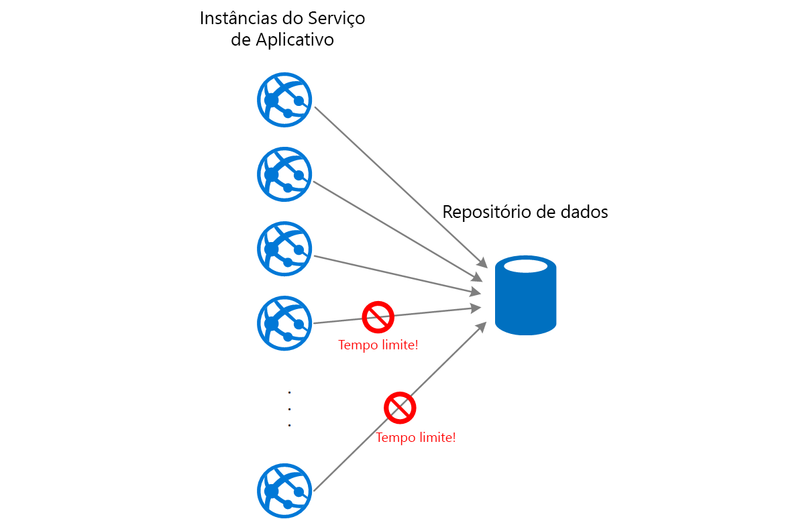
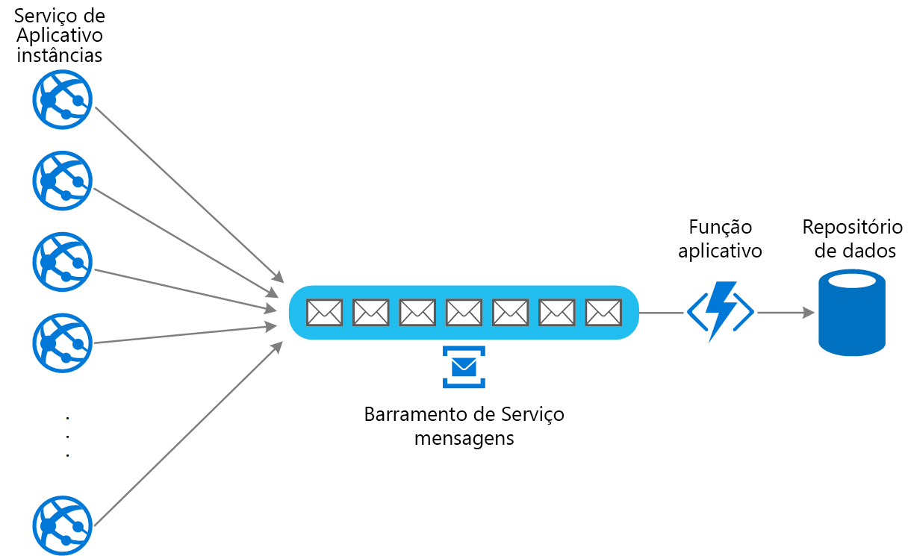

# Padrão de nivelamento de carga baseado em fila

Use uma fila que funcione como um buffer entre uma tarefa e um serviço que ela invoca para simplificar sobrecargas intermitentes que podem causar falha no serviço ou a fazer a tarefa atingir o tempo limite. Isso pode ajudar a minimizar o impacto dos picos de demanda sobre a disponibilidade e a capacidade de resposta para a tarefa e o serviço.

## Contexto e problema

Muitas soluções na nuvem envolvem a execução de tarefas que invocam serviços. Nesse ambiente, se um serviço estiver sujeito a cargas pesadas intermitentes, isso poderá causar problemas de desempenho ou confiabilidade.

Um serviço pode ser parte da mesma solução que as tarefas que o utilizam ou pode ser um serviço de terceiros fornecendo acesso a recursos usados com frequência, como cache ou serviço de armazenamento. Se o mesmo serviço for usado por várias tarefas em execução ao mesmo tempo, poderá ser difícil prever o volume de solicitações para o serviço a qualquer momento.

Um serviço pode apresentar picos de demanda que causam a sobrecarga, não conseguindo responder às solicitações no tempo adequado. Inundar um serviço com um grande número de solicitações simultâneas também pode resultar em falha do serviço se não for possível tratar a contenção que essas solicitações causam.

## Solução

Refatore a solução e introduza uma fila entre a tarefa e o serviço. A tarefa e o serviço são executados de maneira assíncrona. A tarefa envia uma mensagem que contém os dados exigidos pelo serviço a uma fila. A fila atua como um buffer, armazenando a mensagem até que ela seja recuperada pelo serviço. O serviço recupera as mensagens da fila e as processa. Solicitações de várias tarefas, que podem ser geradas a uma taxa altamente variável, podem ser passadas para o serviço pela mesma fila de mensagens. Esta figura mostra o uso de uma fila para nivelar a carga em um serviço.

A fila separa as tarefas do serviço e o serviço pode manipular as mensagens em seu próprio ritmo, independentemente do volume de solicitações de tarefas simultâneas. Além disso, não haverá nenhum atraso para uma tarefa se o serviço não estiver disponível no momento em que ele envia uma mensagem à fila.

Esse padrão proporciona os seguintes benefícios:

- Pode ajudar a maximizar a disponibilidade porque atrasos decorrentes de serviços não terão um impacto direto e imediato sobre o aplicativo, que pode continuar a postar mensagens na fila mesmo quando o serviço não está disponível ou atualmente não está processando mensagens.
- Pode ajudar a maximizar a escalabilidade, pois tanto o número de filas quanto o número de serviços pode ser variado para atender à demanda.
- Pode ajudar a controlar os custos, pois o número de instâncias de serviço implantadas só precisa ser suficiente para atender a carga média, em vez da carga de pico.

    >  Alguns serviços implementam limitação quando a demanda atinge um limite além do qual o sistema poderia falhar. A limitação pode reduzir a funcionalidade disponível. Você pode implementar nivelamento de carga com esses serviços para garantir que esse limite não seja atingido.

## Problemas e considerações

Considere os seguintes pontos ao decidir como implementar esse padrão:

- É necessário implementar lógica de aplicativo que controle a taxa à qual os serviços processam as mensagens para evitar sobrecarregar o recurso de destino. Evite passar picos de demanda para o próximo estágio do sistema. Teste o sistema sob carga para garantir que ele ofereça o nivelamento necessário e ajuste o número de filas e o número de instâncias de serviço que manipulam mensagens para conseguir isso.
- Filas de mensagens são um mecanismo de comunicação unidirecional. Se uma tarefa espera uma resposta de um serviço, pode ser necessário implementar um mecanismo que o serviço pode usar para enviar uma resposta. Para obter mais informações, consulte o [Primer de mensagens assíncronas](https://msdn.microsoft.com/library/dn589781.aspx).
- Tenha cuidado ao aplicar o dimensionamento automático a serviços que estão ouvindo solicitações na fila. Isso pode resultar em maior contenção para quaisquer recursos que esses serviços compartilhem e reduzir a eficiência do uso da fila para nivelar a carga.

## Quando usar esse padrão

Esse padrão é útil para qualquer aplicativo que use serviços sujeitos a sobrecarga.

Esse padrão não é útil se o aplicativo esperar uma resposta do serviço com latência mínima.

## Exemplo

Um aplicativo Web grava dados em um repositório de dados externo. Se um grande número de instâncias do aplicativo Web for executado simultaneamente, talvez o armazenamento de dados não consiga responder às solicitações rápido o suficiente, fazendo com que o tempo das solicitações expire, seja limitado ou falhe. O diagrama a seguir mostra um repositório de dados que está sendo sobrecarregado com um grande número de solicitações simultâneas de instâncias de um aplicativo.

Para resolver isso, é possível usar uma fila para nivelar a carga entre as instâncias do aplicativo e o repositório de dados. Um aplicativo do Azure Functions lê as mensagens da fila e executa as solicitações de leitura/gravação para o armazenamento de dados. A lógica do aplicativo no aplicativo de funções pode controlar a taxa em que ele transmite solicitações ao repositório de dados para impedir que o serviço de armazenamento seja sobrecarregado. (Caso contrário, o aplicativo de funções apenas reintroduzirá o mesmo problema no back-end.)

## Diretrizes e padrões relacionados

Os padrões e diretrizes a seguir também podem ser relevantes ao implementar esse padrão:

- [Prévia de mensagens assíncronas](https://msdn.microsoft.com/library/dn589781.aspx). Filas de mensagens são inerentemente assíncronas. Talvez seja necessário recriar a lógica do aplicativo em uma tarefa se ela tiver sido adaptada de se comunicar diretamente com um serviço para usar uma fila de mensagens. Da mesma forma, talvez seja necessário refatorar um serviço para aceitar solicitações de uma fila de mensagens. Como alternativa, talvez seja possível implementar um serviço de proxy, conforme descrito no exemplo.

- [Padrão de consumidores concorrentes](./competing-consumers.md). Talvez seja possível executar várias instâncias de um serviço, cada uma agindo como um consumidor de mensagem da fila nivelamento de carga. Você pode usar essa abordagem para ajustar a taxa à qual as mensagens são recebidas e passadas para um serviço.

- [Padrão de limitação](./throttling.md). Uma maneira simples de implementar a limitação com um serviço é usar o nivelamento de carga baseado em fila e encaminhar todas as solicitações para um serviço por meio de uma fila de mensagens. O serviço pode processar solicitações a uma taxa que garanta que os recursos exigidos pelo serviço não sejam esgotados e para reduzir a quantidade de contenção que poderia ocorrer.

- [Escolha entre os serviços de mensagens do Azure](/azure/event-grid/compare-messaging-services). Informações sobre como escolher um mecanismo de mensagens e enfileiramento em aplicativos do Azure.

- [Melhore a escalabilidade em um aplicativo Web do Azure](../reference-architectures/app-service-web-app/scalable-web-app.md). Essa arquitetura de referência inclui o nivelamento de carga baseado em fila como parte da arquitetura.
